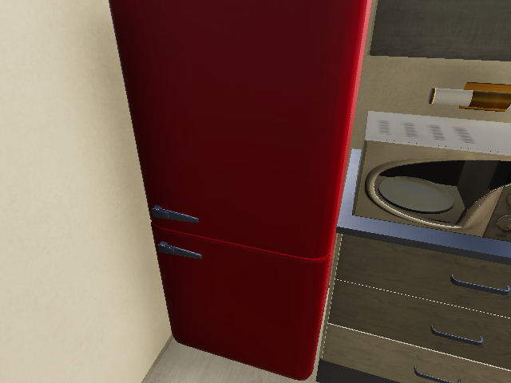
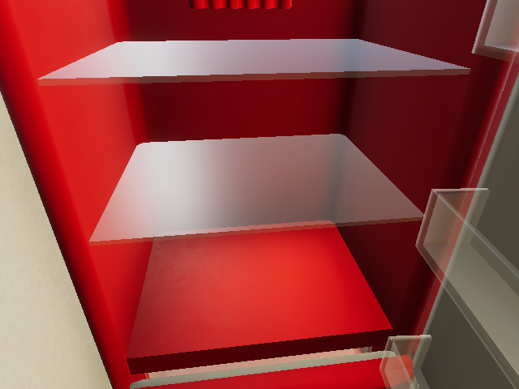

# 仿真任务规划：修订与验证记录

更新日期：2026-10-02。**学生已三次完成同一 ALFWorld 文字任务，两次完成 VirtualHome 六步人工规则任务，两次启动 AI2THOR 自动复测入口通过；Codex 另完成 ALFWorld 清洗任务、VirtualHome 人工规则任务和 AI2THOR 默认 640×480 命令行复测。** ALFWorld 视觉交互、ALFRED 和模型规划仍未运行。以下保留各阶段记录，注明执行者和验证范围。

<a id="virtualhome-runner-20261002"></a>
## 仓库内 VirtualHome 入口与真实失败（2026-10-02 晚）

新增 [virtualhome_checked_demo.py](virtualhome_checked_demo.py)，用一条命令替代依赖两个临时文件和 `python -i` 会话的操作。配套 `planning_checks.py` 继续负责动作/实例格式；运行器保存初始图、每步原始返回值与图、最终图和 `result.json`，在第一步失败时停止后续动作。模型计划只接受严格的 `steps` JSON，不执行回答中的代码。

执行者为 Codex，复用现有 Windows Unity **2.3.0**、官方通信模块提交 `58970fd80951c2eaa1af713e0917d1a105353ad8`、Python **3.12.14**、NumPy **1.26.4**、OpenCV **4.8.1.78**。没有安装依赖、下载模型、请求模型 API 或操作机器人。与学生环境唯一的连接参数差异为本机端口 `18082`；场景仍为 0，角色 `Chars/Female2`，逐步录制 640×480 第一人称图像，10 fps。

| 最终脚本实测 | 真实结果 | 结论 |
|---|---|---|
| 六步规则任务，20:48 | 六次动作均返回真；salmon 327 位于 fridge 305 内，冰箱关闭且 salmon 未被持有；角色 ID 始终为 1；188 帧 | `task_success=true`、`evidence_complete=true`、退出码 0；仅规则任务通过 |
| 故意不拿取就放入，20:49 | 走向冰箱、开门成功；第三步 `PUTIN` 被真实 Unity 拒绝；salmon 不在冰箱内，冰箱仍开着 | `task_success=false`、退出码 1；原失败消息与前后图保留 |
| `--run --prepare`，20:49 | 完成重置和角色添加，保存初始图；动作数 0 | `PREPARED` / `NOT_EVALUATED`、退出码 0；不是任务完成 |

原始失败消息含 `PROCESS PUT: Not found source object: salmon` 和 `EXECUTION_GENERAL: Script is impossible to execute`，完整返回值见[实测摘要](virtualhome-runner-20261002.json)。故意失败计划保留在本机；[公开证据包](virtualhome-evidence-20261002.zip)包含三次最终运行的原始 JSON、各步反馈和场景图，可逐项对照摘要中的哈希。截图分别为正常任务和失败任务的末帧：





失败记录写出时统计 72 帧，Unity 停止后实际保留 74 帧；两份数字按时间分别记录，未回写原 `result.json`。本机另从原帧生成方便观看的 MP4，并完整解码核对正常/失败两段分别为 188/74 帧；公开 ZIP 不包含所有帧或这些派生视频。Unity 由本轮监督器在客户端结束后停止，监督器记录的 Unity 退出码不用于任务验收。

新入口通过 **20 项假控制器测试**，覆盖拒绝旧目录、目标原已达成、持握冲突、丢失/变化的角色、矛盾开闭状态、动作失败后停止、未知反馈和录像缺失；这些测试只验证记录与判断逻辑。已有规划逻辑 **56 项测试**也通过。独立审查发现的“缺角色仍判未持有”已修复，并使用最终脚本完成上表真实复测。更早的本轮首测及历史中止记录仍保存在本机，没有用最终成功覆盖。

`task_success` 和 `evidence_complete` 分开报告；失败也可以有完整证据。录制帧数是检查时已落盘的 PNG 数量，不表示完整播放核验。真实模型请求尚未执行，`--plan-source model` 只是用户自报来源，不认证其为模型输出。

## 学生本机复测（2026-10-02）

以下时间均为 UTC+8；已独立读取原日志、逐步状态和图像核对，三项均未调用模型。

- **ALFWorld，07:30:46—07:31:40。** 原终端日志 `student-20261002-073046.txt` 记录学生手动执行 `go to sidetable 1`、`take alarmclock 3 from sidetable 1`、`go to desk 1`、`move alarmclock 3 to desk 1`，逐步反馈正常，最后输出 `You won!` 和退出码 0。这是闹钟放桌任务的第三次学生复测。
- **VirtualHome，07:29:22 启动。** 记录 `repeat-20261002-072922-511693` 的六步执行及场景图读取均成功；初始三文鱼不在冰箱内，最终 `salmon(327) → fridge(305)` 为 `INSIDE`、冰箱仅含 `CLOSED`、三文鱼未被持握。核对了抓取、开门、放入、关门的状态变化及 171 张 640×480 录像帧；结果为 `task_success=true`，本次进程已停止。
- **AI2THOR，07:32:04—07:32:24。** 学生启动自动入口，记录为 `manual-software-20261001T233204Z`。300×300、`Very Low` 设置下，八条预设动作均成功；原始 metadata 确认同一餐刀在同一杯中、杯在指定台面，正反容器关系一致、物体未被持握且杯未破裂。10 张观测图、退出码 0 和控制器关闭记录齐全。此项为学生启动的预设脚本复测，原 `student_operated:false` 标签保留，不记为学生或模型生成计划。

原始记录保存在仓库外；此前错误输入、VirtualHome 中途退出及 AI2THOR 失败恢复记录均保留。

## 学生本机文字交互复测（2026-10-01）

运行环境为已有 Ubuntu 22.04 虚拟机、Python 3.10.12、ALFWorld 0.5.0（源码固定为 `aaba6870f86c5be6a08a491f32a50b906227bc3e`）、TextWorld 1.6.2。环境信息来自安装后记录，`pip check` 返回 `No broken requirements found.`；没有使用 WSL 或模型 API。

准备阶段由 Codex 安装文字依赖和三份任务数据包，并分别用上游规则专家、官方交互入口重放动作，确认真实 TextWorld 引擎返回 `won: true`。这些自动执行记录与学生操作分开保存，不作为学生亲测证据。

学生随后在官方 `alfworld-play-tw` 终端中亲自输入动作。证据为学生提供的终端截图，以及取回核对的原始终端日志 `student-20261001-152514.txt`；日志记录时间为 15:25:14—15:26:17（UTC+8）。原始日志和截图留在仓库外，公开记录仅列动作与反馈摘要。

本次任务类型为 `pick_and_place_simple`，目标是把闹钟移到桌子；终端原文为 `put a alarmclock in desk.`。任务来自 `pick_and_place_simple-AlarmClock-None-Desk-307/trial_T20190907_072303_146844`。

| 学生输入 | 实际反馈 |
|---|---|
| `go to sidetable1` | `Nothing happens.`；物体名称与编号之间漏了空格 |
| `go to sidetable 1` | 到达边桌，列出其中的 `alarmclock 3` 等物体 |
| `take alarmclock 3 from sidetable 1` | 拿起 `alarmclock 3` |
| `go to desk 1` | 到达桌子 |
| `move alarmclock 3 to desk 1` | `You won!` |

日志以 `COMMAND_EXIT_CODE="0"` 结束。**本次确认一个 ALFWorld 文字人工任务通过，包含输入错误后的修正；不代表全部任务、视觉路线或模型规划通过。** 实验页补充了已使用的文字环境安装方式，以及名称与编号之间保留空格的操作提示。

学生于同日 16:57:14—16:58:15（UTC+8）再次完成同一任务。新增截图与取回的原始终端日志一致：依次到边桌、拿起闹钟、到桌子、放下闹钟，返回 `You won!` 和退出码 0；本轮没有出现漏空格错误。这是同一文字任务的第二次亲测，原始记录仍保存在仓库外。

**Codex 新增清洗任务实测。** 同日复用上述环境与原始任务包，运行 `pick_clean_then_place_in_recep-Apple-None-DiningTable-19/trial_T20190907_230021_185388`：打开微波炉、取出苹果、在水槽清洗，再放到餐桌。上游规则专家在真实 TextWorld 引擎中执行 10 步，返回 `reward=1`、`done=true`、`won=true`；随后用未修改的官方 `alfworld-play-tw` 重放动作，再次输出 `You won!`，退出码 0，两轮共耗时 14.928 秒。独立读取原始证据包核对了开门与清洗反馈、完成状态及任务输入与缓存原文件一致。该任务由 Codex 执行，未调用模型，学生尚未亲测；原日志留在仓库外。

本次文档检查：19 段 Bash 代码通过 `bash -n`；在已下载源码中核对包内 domain/grammar 路径，并在任务包中核对示例的初态和轨迹文件存在；`git diff --check` 通过。

另核对固定源码的视觉依赖、`alfworld-download` 和 `alfworld-play-thor`：下载器准备任务数据、检测器权重和 logic 文件，视觉入口启动 THOR。正文补齐该准备步骤；本次没有执行视觉依赖安装、默认下载器或 THOR。

## VirtualHome 人工规则任务实测（2026-10-01）

前两次成功运行的执行者为 **Codex**，与下方学生复测分开记录。使用官方 Windows Unity 2.3.0 程序，在场景 `0` 中创建 `Chars/Female2` 角色，读取真实场景图后，由手册 `virtualhome_plan` 生成确定性动作；没有调用模型或 API。

运行环境：Windows、Python 3.12.14、RTX 4060 Laptop 8 GB。独立环境使用 NumPy 1.26.4、OpenCV headless 4.8.1.78、Pillow 11.3.0、requests 2.32.5，`pip check` 通过。通信代码取自[固定提交 58970fd](https://github.com/xavierpuigf/virtualhome/tree/58970fd80951c2eaa1af713e0917d1a105353ad8)的完整 `unity_simulator` 通信模块，未修改其内容；没有安装 VirtualHome 全部功能依赖。

初始图中 `salmon(327)` 在 `microwave(313)` 上，`fridge(305)` 为 `CLOSED`，三文鱼尚未在冰箱中。

| 步骤 | 实际动作 |
|---|---|
| 1 | `<char0> [WALK] <salmon> (327)` |
| 2 | `<char0> [GRAB] <salmon> (327)` |
| 3 | `<char0> [WALK] <fridge> (305)` |
| 4 | `<char0> [OPEN] <fridge> (305)` |
| 5 | `<char0> [PUTIN] <salmon> (327) <fridge> (305)` |
| 6 | `<char0> [CLOSE] <fridge> (305)` |

`render_script` 使用 `find_solution=False`、`skip_execution=False`、`skip_animation=False`，开启 `FIRST_PERSON` 录像，分辨率 640×480、帧率 10。实际返回 `success=true`；执行后重新读取环境图，确认 `327 → 305` 存在 `INSIDE` 关系、冰箱状态仅含 `CLOSED`、三文鱼未在角色手中，任务通过。

本机保留前后场景图、计划、原始执行反馈和 168 张连续渲染帧。已查看放入与关门关键帧；静态相机的浴室视角没有用作目标证据。Unity 动作帧表将 `PUTIN` 阶段标为内部名称 `PUTBACK`，原记录保持不变，最终判据仍取实际场景关系与门状态。原始文件留在仓库外。

随后通过本机复测入口重新加载场景，逐步执行同样的六条动作；每步均返回成功，最终目标关系再次通过，输出单独保存。该轮同样由 Codex 执行，没有记为学生亲测。

**学生首次复测中途退出。** 同日 18:12（UTC+8），学生运行逐步入口，前 5 步的执行反馈与场景图读取均成功；第 6 步 `CLOSE` 前输入 `q`，任务中止。最后保存的场景图确认 `salmon(327) → fridge(305)` 存在 `INSIDE` 关系、三文鱼未被持握，但冰箱仍为 `OPEN`。原结果保留 `task_success=UNKNOWN`、`stopped_by_user=true`，本次仿真进程已关闭；5 步记录及 102 张录像帧均保留在仓库外。该轮未完整通过；此前 Codex 两次成功记录保持不变。

**学生重新执行后完整通过。** 同日 18:50:02（UTC+8）启动的新记录为逐步交互模式，六条动作均返回 `render_success=true` 和 `graph_success=true`，包括最后的 `CLOSE`。独立核对初末场景图：初始三文鱼不在冰箱内；最终 `327 → 305` 存在 `INSIDE` 关系，冰箱状态仅含 `CLOSED`，三文鱼未被持握。原结果为 `task_success=true`，保存了六步场景图、最终场景图和 196 张录像帧，本次仿真进程已结束。该学生复测通过，前次中止记录未改写；没有调用模型规划。

这次实测覆盖一个人工规则任务，没有验证模型生成计划、其他场景或成功率。学生页补充通信模块安装与导入方式，以 `vh_init.py` 和 `vh_execute.py` 保持同一 Python 会话，避免把多段控制语句直接粘入交互提示符；原有模型路线继续标为未运行。

本次文档检查：3 段 Python 代码语法、PowerShell 代码语法、相对链接和代码围栏通过；使用真实场景图在 Windows PowerShell 5 中生成计划和中文提示词，确认 UTF-8 内容往返正确。PowerShell 写出的 BOM 由 `utf-8-sig` 正确读取；该检查没有发送模型请求。

## AI2THOR 人工规则任务实测（2026-10-01）

首次执行者为 **Codex**。在已有 Ubuntu 22.04 虚拟机中运行 AI2THOR 5.0.0、Python 3.10.12，使用官方 Unity 构建 `f0825767cd50d69f666c7f282e54abfe58f1e917`，下载及传输后均通过官方 SHA256 校验。独立环境的 `pip check` 通过；实际 Unity 日志显示 llvmpipe 软件渲染、OpenGL 4.5。首次分辨率为 300×300，画质为 `Very Low`，通过 Unix FIFO 通信。

2026-10-02 将这套已实测的最小安装步骤同步至学生页：Python 3.10 venv，AI2THOR 5.0.0、NumPy 1.26.4、OpenCV 4.10.0.84、Flask 2.1.1、Werkzeug 2.0.3、Pillow 11.0.0；本机设置 `LIBGL_ALWAYS_SOFTWARE=1`。安装清单与保存的环境记录一致，未安装课程整套 CUDA/训练依赖。模型路线单独补装课程 DashScope 1.23.1，该 SDK 与本最小环境组合及真实模型调用尚待验证。

先在 `FloorPlan10` 中取得真实图像，执行 `RotateRight` 后返回成功，图像随视角变化。随后重新启动场景，使用已校验来源的课程控制器和手册 `checked_controller` 包装，自动执行下列人工预设动作。目标 ID 来自本次场景；没有调用模型或 API，也没有使用 Mock。

| 步骤 | 实际动作 |
|---|---|
| 1 | `GotoObject-Cup\|+01.08\|+00.90\|-00.77` |
| 2 | `PickupObject-Cup\|+01.08\|+00.90\|-00.77` |
| 3 | `GotoObject-CounterTop\|+00.93\|+00.95\|-02.05` |
| 4 | `PutObject-CounterTop\|+00.93\|+00.95\|-02.05` |
| 5 | `GotoObject-ButterKnife\|-01.33\|+00.92\|-00.88` |
| 6 | `PickupObject-ButterKnife\|-01.33\|+00.92\|-00.88` |
| 7 | `GotoObject-Cup\|+01.08\|+00.90\|-00.77` |
| 8 | `PutObject-Cup\|+01.08\|+00.90\|-00.77` |

八步均返回 `lastActionSuccess=true`。初始杯内为空，杯和黄油刀位于不同台面；执行后，原始 metadata 确认同一黄油刀在同一杯中、杯在所选台面上，正反向容器关系一致；两物体均未被持握，杯未破裂。最终目标通过，退出码为 0，控制器正常关闭。逐步图像、原始 metadata 和 Unity 日志保存在仓库外。

这次确认一个人工规则任务通过，沿用课程 `GotoObject` 的传送及部分动作的 `forceAction`。它不是学生亲自规划或模型规划结果，也不提供标准导航成功率。该轮未触发失败处理；后续空手放置与恢复检查见下文，LLM 路线仍未运行。

本机复测入口沿用相同预设动作，每次保存新的运行目录，不重新下载资源。本次检查通过入口的 Bash 与内嵌 Python 语法、动作表渲染和 `git diff --check`；原始物体 ID 在表格中完整保留。

**学生启动自动入口复测。** 学生截图显示运行 `verify-ai2thor.sh` 并返回通过；对应原始记录时间为 17:00:35—17:00:46（UTC+8）。八步动作均成功，初始空杯、最终容器关系及物体状态再次核验通过，退出码为 0。该轮由学生启动，动作仍由脚本预设执行；原 JSON 中固定的 `student_operated:false` 标签保留，不将该结果记为学生逐步规划。

**默认命令行入口复测。** Codex 随后运行未改写的 `ai2thor_checked_demo.py --run --mode manual`，保持默认 640×480、`Ultra` 画质及 llvmpipe 软件渲染。复用已经校验的官方 Unity 缓存，并用临时进程网络限制阻止额外下载；运行前后，入口、辅助脚本和课程文件的 SHA256 一致。通过标准输入依次提供上述八条动作和 `Done`，仍属于 Codex 自动供入人工预设动作。

该轮八步均返回成功，`Done` 记录为未分发动作，结束原因为 `USER_DONE`，退出码为 0。已查看真实 640×480 图像并独立核对初末 metadata，确认黄油刀、杯、台面的同一实例关系及未持握、未破裂状态。原始 `run.json` 的 `task_success: NOT_EVALUATED` 未改写；目标通过结论来自独立状态验收。图像、原始 metadata、Unity 日志和网络检查记录均留在仓库外。

**真实失败反馈与恢复检查。** Codex 继续使用原 CLI、默认 640×480 / `Ultra` 和已缓存 Unity，在到达台面后空手执行 `PutObject`。该动作实际分发，Unity 返回 `lastActionSuccess=false`，原错误 `Can't place an object if Agent isn't holding anything` 完整保存在 metadata、`run.json` 与控制台。失败前后手中均为空，杯的容器关系未改变；随后到杯旁、拿杯、返回台面、放杯四步均成功，原状态确认中途持杯、最终杯位于指定台面且未持握、未破裂。六步反馈依次为 `true、false、true、true、true、true`；`Done` 未分发，退出码为 0，耗时 25.269 秒，源码前后哈希一致。独立读取证据包核对以上状态后，失败反馈与恢复检查通过；本轮未执行放刀目标，原 `task_success=NOT_EVALUATED` 保留，没有调用模型。

## 原修订阶段（2026-09-20）

本阶段完成教材/源码审阅和辅助逻辑离线检查，当时尚未运行真实交互。下文保留当时的检查结果。

## 来源与归因

- 本轮重新读取《具身智能导论-v2.0.pdf》印刷页 133—140（PDF 第 151—158 页）并查看页面图像。页面保留教材三部分结构：ALFWorld、ALFRED、基于大模型的规划；第三部分包含 AI2THOR 和 VirtualHome。
- 在已有 `feature/whr` 上修订，起点为 `7a9b42600858b3dd15edc889e3f0b98f13fc0fe0`，保留第一个实验的文件和提交。原规划页 blob `1c11203c710ce3e28f62f4a096dd5523830e6313` 与附件 manifest 一致。
- 附件作者的 `checks/` 记录了 Linux、Python 3.13.5 下 32 项测试及静态预览；那不是学生本机或本轮 Codex 的执行结果。本次独立审阅、修订候选后重新测试，实际结果另列。未把附件 `preview/` 作为网站部署目录提交。

只读核对课程 [EAI_project 固定提交](https://github.com/SH9959/EAI_project/tree/e6bb5d5de828b5d87834ea169b53c09b376d8b09)：

- [AI2THOR demo](https://github.com/SH9959/EAI_project/blob/e6bb5d5de828b5d87834ea169b53c09b376d8b09/chapter_4/4_1_task_planning/for_simulator/for_ai2thor/demo_in_ai2thor.py)，blob `836a98e382f12d7e2ea77aa10e28914c1dcd30ee`。
- [myController.py](https://github.com/SH9959/EAI_project/blob/e6bb5d5de828b5d87834ea169b53c09b376d8b09/chapter_4/4_1_task_planning/for_simulator/for_ai2thor/myController.py)，blob `aadd9fd3fdbc8274ea2dbb28a70ef0ed9989b55c`。
- [action.json](https://github.com/SH9959/EAI_project/blob/e6bb5d5de828b5d87834ea169b53c09b376d8b09/chapter_4/4_1_task_planning/for_simulator/for_ai2thor/action.json)，blob `189c5672cce57400c6858517def3987c4789630a`。
- 同目录 requirements.txt 固定 AI2THOR 5.0.0、DashScope 1.23.1，并含 Linux GPU 依赖；本轮未安装这些依赖。
- [VirtualHome demo](https://github.com/SH9959/EAI_project/blob/e6bb5d5de828b5d87834ea169b53c09b376d8b09/chapter_4/4_1_task_planning/for_simulator/for_virtualhome/demo_in_virtualhome.py)，blob `421a754e91fca5688765afc7512bf002f7aa272a`。

另读取 [ALFWorld README](https://github.com/alfworld/alfworld/blob/master/README.md) 和[下载脚本](https://github.com/alfworld/alfworld/blob/master/scripts/alfworld-download)、[ALFRED README](https://github.com/askforalfred/alfred/blob/master/README.md)、[模型说明](https://github.com/askforalfred/alfred/blob/master/models/README.md)、训练/评测参数，以及 [VirtualHome README](https://github.com/xavierpuigf/virtualhome) 和 [setup.py](https://github.com/xavierpuigf/virtualhome/blob/master/setup.py)。这些公开材料核对不代表安装成功；可变分支更新后需要重新检查。

## 问题与修订

| 编号 | 问题 | 处理与证据边界 |
|---|---|---|
| P01 | `Done` 在技能表中，但没有对应控制器方法，原循环仍可能分发 | 主循环精确处理结束词；假控制器测试，不是 Unity 运行 |
| P02 | `split('-')` 截断含负坐标的完整物体 ID | 用 `partition('-')` 保留整个目标串 |
| P03 | 动作大小写、白名单与方法名不一致 | 映射到规范技能名，拒绝未知及重复技能 |
| P04 | 物体子串匹配可能选错对象，空列表取 `[0]` 会崩溃 | 精确 ID/类型匹配；重名要求完整 ID，空目标或接近姿态明确报错 |
| P05 | `'false' in str(False)` 漏掉失败；缺字段也不能当成功 | 检查布尔反馈，将失败信息送回下一轮；执行后反馈未知时停止并如实记录 |
| P06 | `Done` 和退出码不能证明目标实现 | 记录结束原因，`task_success` 保持 `NOT_EVALUATED` |
| P07 | ALFRED 教材目录、续行注释与实际预处理/模型输入不一致 | 统一根目录、`json_feat` 数据、checkpoint 与评测输出；标注数据准备调整，未训练或评测 |
| P08 | VirtualHome 教材 Python 3.9 与当前声明 ≥3.10 不符 | 保留历史 Unity 2.3.0 线索，要求匹配版本及连接样例，不修改版本声明绕过安装 |
| P09 | 课程实际脚本操作 cereal 且硬编码 ID，教材目标是 salmon | 从本轮图精确选 salmon/fridge；当时该示例尚未实测，后续 Unity 结果见本页顶部 |
| P10 | 候选入口的格式错误可能不记录；截图失败会误记已执行动作 | 保留拒绝动作，区分执行状态未知与未执行，写盘失败不重复登记动作 |

`planning_checks.py` 和 `ai2thor_checked_demo.py` 是新增辅助工具/手册侧包装入口，未修改课程控制器或 EAI_project。步数限制、手动模式、发送开关和运行记录属于辅助修订，不是教材原代码已完整跑通的证明。当前演示含粗粒度动作和部分 `forceAction`，不能据此报告标准导航或任务成功率。

## 本轮实际执行

执行者：Codex，通过当前 Windows PowerShell 工作区运行；Python **3.12.5**。这不是学生自行操作的记录。以下命令从手册仓库根目录执行，使用标准库、合成场景图/metadata 和假控制器。

```text
python docs/assets/ch4-planning/test_planning_checks.py
Ran 47 tests
OK
```

47 项测试覆盖动作协议、负坐标 ID、精确目标、空接近姿态、布尔反馈、技能白名单、课程文件版本、VirtualHome 节点/状态和包含方向。其中主循环测试检查 Done 不分发、拒绝动作留档、失败反馈回传、执行状态未知时停止、截图失败不重复记录及退出释放；模型和模拟器由 Mock 替代。

| 命令 | 实际结果与范围 |
|---|---|
| `python docs/assets/ch4-planning/planning_checks.py action --text "PickupObject-Cup"` | 返回 0，输出 `FORMAT_ONLY`、`executed: false`、`task_success: NOT_EVALUATED` |
| 下方负坐标 ID 命令 | 返回 0，完整保留目标 ID，输出仍为 `FORMAT_ONLY` |
| `python docs/assets/ch4-planning/planning_checks.py action --text "Done-Cup"` | 返回 2，拒绝带目标的 Done |
| `python docs/assets/ch4-planning/ai2thor_checked_demo.py --help` | 正常列出参数 |
| `python docs/assets/ch4-planning/ai2thor_checked_demo.py --course-dir chapter_4/4_1_task_planning/for_simulator/for_ai2thor` | 返回 0，输出 `CHECK ONLY`；使用手册仓库已有课程代码副本，仅校验两份文件的 Git blob 和技能表 |

负坐标 ID 的实际检查命令：

```powershell
python docs/assets/ch4-planning/planning_checks.py action --text "PickupObject-Cup|-00.25|+01.00|-02.00"
```

来源预检没有使用 `--run` 或 `--send`，不导入课程控制器，也没有启动 Unity、调用模型或验证任务成功。未修改本地课程副本。

## 文档与提交范围检查

本轮对两项实验合计 5 个 Python 文件执行内存编译检查，对页面内 3 段 Python 示例做 AST 语法解析，均通过。它们不代表教材 Python 3.9/仿真依赖环境已验证。`git diff --check`、4 份相关 Markdown 的相对链接及构建后 HTML 本地资源/锚点检查通过。

完整仓库使用已有 MkDocs 1.6.1、Material 9.7.7 环境构建成功，输出在仓库外临时目录；HTML 中文、代码块和导航由解析检查通过，本轮未做浏览器目视验收。修改前已有 Material 关于未来 MkDocs 2.0 的提示，以及第一个实验两份辅助页未列入导航的 INFO；本次新增两份验证记录未列入导航的 INFO，已分别由实验页链接进入。未发现新增文档 WARNING。Git 的 LF→CRLF 提示不是空白格式错误。

仅提交本实验页、两个辅助脚本、测试和本记录；未修改 `site/`、部署工作流或 EAI_project。抓取实验使用独立提交，第一个实验的修改保留。

## 首次 ALFWorld 环境预检（历史记录）

首次只读检查 Windows 主机时，`wsl --list --verbose` 返回未安装 WSL；Conda 可用，列出的 8 个环境中未找到 ALFWorld；默认缓存候选位置和 `ALFWORLD_DATA` 环境变量未发现可用数据。该检查未涵盖所有磁盘、远程 Linux 主机或实验室共享盘。后续找到已有 Ubuntu 22.04 虚拟机，并完成本页顶部记录的安装和学生交互。

当时确定优先验证不需要模型 API Key 的 TextWorld 人工交互，先核实 Linux 机器、缓存和下载目录。预检阶段没有安装 WSL、创建环境或下载数据。

当时核对的官方默认下载器会获取三份游戏/JSON/PDDL 压缩包，合计 **143,407,869 字节**，以及 **177,877,450 字节**的 Mask R-CNN 权重，总计 **321,285,319 字节（约 321 MB）**；这些数字来自 [0.2.2 发布附件元数据](https://github.com/alfworld/alfworld/releases/tag/0.2.2)和 [0.4.2 发布附件元数据](https://github.com/alfworld/alfworld/releases/tag/0.4.2)，预检时未下载其内容。Python 依赖、解压和环境空间另计，当时未测量其总量。只安装不带 `[full]` 的 Python 包，并不会让默认下载器跳过视觉权重。

后续采用独立 Python 3.10 虚拟环境，只下载上述三份任务包（共 143,407,869 字节）及固定版本源码，没有运行默认下载器，也没有下载视觉权重。学生交互结果见本页顶部记录。

## 各路线状态与后续复测

| 路线 | 当前状态 | 下一条真实证据 |
|---|---|---|
| ALFWorld TextWorld | 学生三次完成闹钟放桌任务（最近一次 2026-10-02）；Codex 另完成苹果清洗放餐桌任务 | 两类任务均有真实引擎及官方 CLI 完成反馈；清洗任务待学生亲测 |
| ALFWorld THOR | 未运行 | 文字路线后配置匹配渲染环境，记录图像、动作和结果 |
| ALFRED | 未运行 | 匹配历史依赖、数据与预训练模型，先真实评测，再决定是否训练 |
| AI2THOR 人工规则任务 | 学生两次启动 300×300 自动复测通过（最近一次 2026-10-02）；Codex 默认 640×480 命令行复测及失败恢复检查通过 | 已核对八步目标任务、原始失败反馈、后续恢复状态与 Done 处理；学生逐步规划和其他任务尚未验证 |
| AI2THOR LLM | 未运行 | 手动仿真通过，再确认合法 Key 和预算，使用 `--send`；核对动作反馈及最终目标 |
| VirtualHome 人工脚本 | 同一真实 Unity 任务两次通过（Codex，2026-10-01）；学生两次完整执行六步通过（最近一次 2026-10-02） | 已核对学生六步反馈、最终 `INSIDE` / `CLOSED` / 未持握状态；首次 5/6 步中止的 `UNKNOWN` 记录保留 |
| VirtualHome LLM 扩展 | 已补操作入口与离线协议检查，真实调用和执行未运行 | 人工脚本通过后，接入模型计划，保留执行反馈并核对最终环境图 |

上述已完成项之外，没有调用收费 API、训练模型或启动机器人。Mock、格式检查和 `PLAN_ONLY` 仍不能写成真实平台实验通过。

## 文案复核（2026-10-01）

实验页统一为“实验目标、实验环境配置、实验过程、实验结果、排错建议与注意事项”。环境准备集中在第二节，四个平台的操作集中在第三节；删除页首维护状态和正文中重复的源码问题表，本记录的原始问题表及未运行清单保留。

17 个代码块与该阶段起点 `0721543` 完全一致，保留 Done、完整物体 ID、目标查找、失败和未知反馈的处理说明。该文案复核阶段未重跑上述 47 项测试，未安装或启动仿真器，也未训练或调用模型。跨页语法、链接、构建与浏览器检查见[本轮文案复核记录](../ch3-dialogue/verification.md#editorial-review-20261001)。

## 第3—5章补全（2026-10-01）

这是同日文案复核之后的新一轮工作，起点为 `db072e9`。重新读取并查看新提供教材 PDF 第 151—158 页；保留 ALFWorld、ALFRED、AI2THOR 和 VirtualHome 路线。本轮补充 ALFWorld 的任务目录复用、VirtualHome 连接初始化、角色添加、模型生成动作和结果检查。

重新核对以下上游固定源码，未安装其依赖或下载仿真程序：

- [ALFWorld aaba687](https://github.com/alfworld/alfworld/tree/aaba6870f86c5be6a08a491f32a50b906227bc3e)：`alfworld-play-tw` 接受任务目录、打印 `Playing` 与 `You won!`，通过 HumanAgent 提供自动补全。
- [ALFRED f91f4c0](https://github.com/askforalfred/alfred/tree/f91f4c0c96c7a29f33d0557f86b0a21035379b3b)：重新核对 requirements、README 和模型说明；PyTorch 1.1.0、torchvision 0.3.0、AI2THOR 2.1.0 属历史环境，未与其他实验环境混装。
- [VirtualHome 58970fd](https://github.com/xavierpuigf/virtualhome/tree/58970fd80951c2eaa1af713e0917d1a105353ad8)：读取 setup、README、Unity demo 和 `comm_unity.py`，核对包内导入路径、8080 端口、reset/add_character 的布尔返回值，以及 render_script 的参数与返回值。Python ≥3.10 与固定旧依赖的完整兼容环境仍待实机安装验证。

新增 `vh-prompt` 和 `vh-check` 为手册侧辅助命令，分别生成问题文本和检查模型回答；通过第3章已有 API 入口衔接，未新建模型服务。检查器限制 JSON 结构、动作名、角色、节点 ID、参数数量和对象类型，不模拟可达性或执行顺序，输出仍为 `PLAN_ONLY`、`executed: false`、`NOT_EVALUATED`。本轮用合成图和回答测试，没有发出模型请求。

VirtualHome 执行示例改为 `find_solution=False`，按本轮图的实例 ID 执行；最终同时核对三文鱼到指定冰箱的 `INSIDE` 关系、冰箱关闭状态和录像。交叉审阅发现“提示词要求关门而结果只检查包含关系”的遗漏，已补齐关门判据。

实际运行 `python -B docs/assets/ch4-planning/test_planning_checks.py`，Python 3.12.14 下 **56 项测试通过**，其中新增 9 项检查模型输出协议、错误 ID、代码/多动作文本、参数、空/超长计划及 CLI 状态。原 47 项也在本次执行中通过。7 个手册辅助 Python 文件通过内存编译；人机对话 36 项、抓取 30 项离线测试在本轮分别重跑通过，均不代表模型或设备运行。

VirtualHome 模型路线在手册补全阶段补齐了学生操作与离线检查入口，替代前一阶段的“未实现”状态；截至该阶段，真实模型调用、Unity 连接和执行均未运行。后续 ALFWorld 文字交互及 VirtualHome 人工任务的实测进展见本页顶部；模型调用仍未运行。实机规划、导航、ACT 的检查分别见[实机记录](../ch4-real/verification.md)、[导航记录](../ch4-navigation/verification.md)、[ACT记录](../ch5-imitation/verification.md)。

整体复核使用已有文档环境完成全仓库 MkDocs 构建，输出在仓库外；未写入 `site/`。六项实验均使用统一的五个二级标题，标题无下划线；9 段正文 Python 示例通过语法解析，34 处相对文件链接及生成页面中的 1,656 处站内链接、资源和锚点检查通过。浏览器查看了首页、学生入口、仿真规划、实机规划、导航及 ACT 页面，中文、目录、代码块和表格显示正常。`git diff --check` 通过。上述为手册补全阶段的文档与离线检查，该阶段未启动实验平台。
