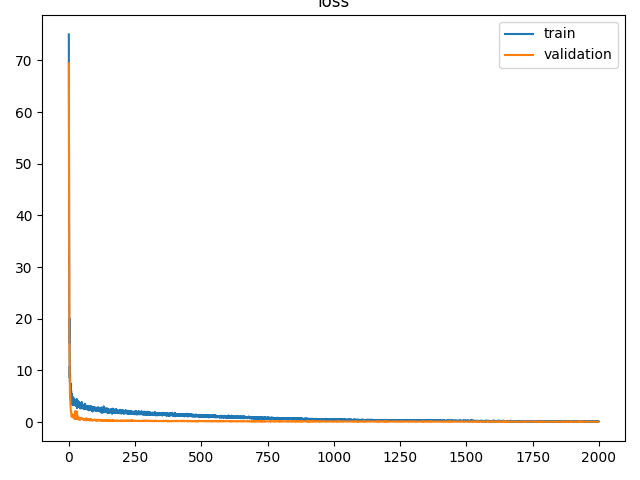

# ACT 模仿学习：修订与验证记录

更新日期：2026-10-02。**已完成 50 条示教、2000 epoch 训练及完整 50 回合 CPU 策略评估：原判据成功 37/50（74%），平均回报 490.26。** 末步奖励仍为 4 的有 34/50 回合。训练使用 Windows CUDA 适配环境，评估使用 Ubuntu CPU 适配；教材 Linux CUDA 入口与实机实验仍待验证。

## 完整数据集与训练（2026-10-02）

执行者为 Codex，使用 ACT 固定提交 `742c753c0d4a5d87076c8f69e5628c79a8cc5488`。本节为新数据集的完整训练记录；后文保留此前两条示教、学生复测、短训练及失败闭环的历史结果。

### 50 条示教采集

采集在 Ubuntu 22.04 虚拟机中完成：4 vCPU、4 GB 内存和约 4 GB 交换空间；Python **3.10.12**、torch **2.0.1+cpu**、MuJoCo **2.3.7**、dm_control **1.0.14**、NumPy **1.26.4**，使用 OSMesa 渲染。

- **50 次尝试全部通过**末端空间示教与关节回放，两阶段最高奖励均为 4；没有筛除失败回合。
- 50 个采集种子、初始位姿、数值轨迹和 HDF5 文件哈希各不相同。每条保留 400 步，关节位置、速度和动作均为 `(400,14)`，`top` 图像为 `(400,480,640,3)`。
- 50 份 HDF5 共 **18,437,041,600 字节**。采集器完成数据和视频验收；训练前后分别重新检查全部文件哈希、轨迹、数值有限性和尺寸，结果一致。

### 2000 epoch 训练

训练在 Windows 的 RTX 4060 Laptop 上完成，使用 Python **3.12.12**、torch **2.7.1+cu118**、torchvision **0.22.1+cu118**、NumPy **1.26.4**。环境还安装了 MuJoCo **3.1.6**、dm_control **1.0.20**；本次训练读取上述 Ubuntu 数据，没有在 Windows 重新采集示教。

运行原 `imitate_episodes.py`，保留 **50 条数据、batch size 8、2000 epochs、seed 0**，以及 100 步动作块、hidden dimension 512、feedforward dimension 3200、KL 权重 10、学习率 `1e-5`。独立训练副本只修改 `constants.py` 的数据目录，以及 `utils.py` 两个 DataLoader 的 `num_workers=0` 并删除 `prefetch_factor`；其余 46 个文件不变，原始 48 文件副本保持完整。单进程加载改变随机采样所在的进程，不保证与 Linux worker 配置逐位一致。

| 检查 | 实际结果 |
|---|---|
| 完整训练 | 日志覆盖 epoch 0—1999；每轮训练、验证损失均有限，退出码为 0；训练耗时 **2936.25 秒** |
| 最佳检查点 | epoch **1955**，验证损失 **0.03864**；`policy_best.ckpt` 与该轮保存的模型张量一致，并非初始化模型 |
| 最后检查点 | 浮点张量均有限；动作输出层相对 epoch 0 的最大变化约 **0.01306** |
| 输出 | 23 份检查点、配套 `dataset_stats.pkl` 和 3 张损失曲线；best 为 **336,112,647 字节** |
| 文件完整性 | 原始源码、训练副本和数据的运行前后记录一致；未新增下载 |

独立复核重新读取了全部 50 条数值轨迹，逐条哈希与采集清单一致，并核对文件尺寸、修改时间和训练硬链接；抽查第 0、25、49 条的首末图像及第 0 条完整文件哈希。原始与训练副本各 48 个文件的当前哈希均与前后记录一致。best、统计文件的完整哈希重新计算通过，best 的序列化张量内容与 epoch 1955 文件逐项一致。



上图为原训练程序保存的损失曲线。训练损失下降不能代替仿真任务的成功率。

| 文件 | SHA-256 |
|---|---|
| `collection-manifest.json` | `a283e6867212c2a406ba966e40401f454ae07c50f262f1ecb8fcf7a2a4b0f0a2` |
| `policy_best.ckpt` | `620d3909885eae69c238c990eb4e89ba51ee81dfd7fcb50712ba6cef4191ac7e` |
| `dataset_stats.pkl` | `173b1ace400c454f2faf664e6bac8077c01a542ea4bf70da2522ad261822c6b4` |

采集清单、训练日志、配置差异、检查点和独立审计记录保存在仓库外。随后固定使用本次 best 与配套统计文件，完成同一输入的 GPU/CPU 输出比较和下述 50 回合评估。

## 完整模型的 50 回合评估（2026-10-02）

执行者为 Codex，使用 Ubuntu 22.04、Python 3.10.12、torch 2.0.1+cpu、torchvision 0.15.2+cpu、MuJoCo 2.3.7、dm_control 1.0.14 和 OSMesa。CPU 适配副本仅修改 `detr/main.py` 与 `imitate_episodes.py` 的设备放置、严格加载、轨迹记录和停止处理；其余 46 个文件不变，完整差异已保存。任务、动作处理和奖励规则沿用固定提交。

运行前严格加载同一 best 的 344 个张量。CPU 与 GPU FP32 对同一真实输入的归一化动作最大差值为 `1.90735e-6`，物理动作最大差值为 `9.53674e-7`，通过原 `rtol=atol=1e-4`；没有放宽阈值。

| 项目 | 实测结果 |
|---|---|
| 评估设置 | 一次调用原 `eval_bc`，连续运行 50 回合；seed 1000，每回合 400 步，第 0/100/200/300 步查询模型；未启用 temporal aggregation |
| 原任务成功率 | **37/50（74%）**；13 回合未达到奖励 4，全部保留 |
| 平均累计回报 | **490.26** |
| 末步状态补充 | **34/50** 回合末步奖励为 4；另外 3 回合曾达到 4、末步已不足 4，不计作“结束时仍满足条件” |
| 运行 | 正常退出，评估进程耗时 **3475.56 秒**，约 58 分钟；监督器确认子进程已结束 |
| 输出核对 | 50 份数值轨迹、50 段三视角视频、首末图像和原汇总完整；视频共 **20,000 帧**，每段 400 帧、1920×480、50 fps |


逐回合结果、环境版本和模型哈希见[本次结果数据](act-evaluation-20261002.json)。独立审计重新读取全部数值轨迹、完整解码全部视频，核对 seed 1000 的连续初始位姿序列，以及原文本汇总、工作进程和监督器结果，均一致；258 份导出证据的哈希检查通过，未筛除失败回合。原件与视频保存在仓库外，公开摘要不含模型文件或本机路径。

原成功标准是回合内最高奖励达到 4，即该步方块接触左侧夹指且不接触桌面；它没有要求结束时继续保持。以下回合编号从 0 开始：回合 1 曾达到奖励 4，但末步奖励为 0，末帧方块已回到桌面；回合 2 末步奖励为 4，末帧可见方块位于左夹爪。末步奖励只是补充观察，不能单独证明稳定夹持。保存的视频帧位于对应动作之前，最后一帧与最后一步动作后的奖励并非同一时刻。

本机适配环境的仿真采集、完整训练和评估流程至此完成，实测策略仍有失败。此前两条示教、3 轮短训练模型的 0/1 失败结果保留在下文。

## 仿真示教验证

采集阶段由 Codex 在 Ubuntu 22.04 虚拟机中执行：4 vCPU、4 GB 内存、约 4 GB 交换空间；Python **3.10.12**、torch **2.0.1+cpu**、MuJoCo **2.3.7**、dm_control **1.0.14**、NumPy **1.26.4**。使用 OSMesa 软件渲染；该阶段未下载预训练权重，后续 GPU 检查另见下文。

ACT 固定提交为 `742c753c0d4a5d87076c8f69e5628c79a8cc5488`。原始 `record_sim_episodes.py` 分两次执行，每次采集一条，输出到不同目录；未改动上游源码，48 个文件与固定提交逐一核对一致。

| 示教 | 末端空间策略 | 关节回放 | 采集耗时 |
|---|---|---|---|
| A | Successful，回报 619 | Successful，回报 646；`Success: 1 / 1` | 129.94 秒 |
| B | Successful，回报 621 | Successful，回报 641；`Success: 1 / 1` | 126.42 秒 |

- 两份 HDF5 各为 **368,740,832 字节**；`sim=True`，动作、关节位置及速度均为 `(400,14)` 且数值有限，`top` 图像为 `(400,480,640,3)`、`uint8`。
- 原可视化脚本生成两段视频及关节曲线。视频均可完整解码 **400 帧、640×480、50 fps**；首末帧可见双臂和方块，末帧方块位于左侧夹爪。
- 两次采集峰值常驻内存约为 1.95 GB 和 2.02 GB。采集、可视化及数据检查均正常退出。
- 初次单帧渲染检查在退出时出现 dm_control 资源释放警告；后续两次完整采集和可视化未出现该警告。

示教回放执行的是脚本产生的关节轨迹，不能据此报告 ACT 学习策略的成功率。

### 学生本机复测（2026-10-01）

学生通过 Ubuntu 桌面实验菜单选择“ACT 示教采集与回放”，在上述环境中启动原始采集、可视化和文件检查脚本。新增输出单独保存，没有覆盖前两条示教。

截图中的 `Successful, episode_return=618` 对应末端空间示教；取回的完整日志随后记录关节回放 `Successful, episode_return=643`，最后为 `Success: 1 / 1`。HDF5、视频和关节曲线均已生成。本次由学生亲自启动，动作由原始示教脚本自动执行，属于采集与回放复测；未运行 ACT 模型训练或策略评估。原始日志和文件保存在仓库外。

独立检查本轮文件通过：HDF5 为 368,740,832 字节，400 步关节数据数值有限，图像尺寸与类型正确；视频完整解码 400 帧、640×480、50 fps，已查看末帧方块位于左侧夹爪。48 个上游源文件仍与固定提交一致，检查器退出码为 0。

### 批量采集前检查（2026-10-01）

Codex 在上述 Ubuntu 原环境中，以种子 **2026100100** 为新数据集采集首条示教。初始方块位置为 `(0.182933, 0.526233, 0.05)`；末端空间回报 **626**、关节回放回报 **638**，两阶段最高奖励均为 4，原日志为 `Success: 1 / 1`。采集耗时 150.33 秒，连同可视化和审计共 **158.4 秒**。HDF5 的 400 步关节数据、全部图像及 **400 帧、640×480、50 fps** 视频检查通过，末帧可见方块位于左夹爪；原 48 个源文件保持一致。

当时为批量采集设置每次尝试的不同种子，记录真实初始位姿和数据哈希，收录通过验收且不重复的示教，保留失败记录；目标为 50 条，最多尝试 75 次。

同日 23:34（UTC+8）启动后续采集。整组采集、数据验收和 Windows CUDA 训练随后完成，结果见本页“完整数据集与训练”。

### CPU 采集复测

此入口只复测示教采集与视频，适用于 Ubuntu 22.04 / Python 3.10。训练继续使用[正文的 GPU 环境](../../student/ch5-imitation.md#21-act)。软件渲染配置依据 [dm_control 官方说明](https://github.com/google-deepmind/dm_control#rendering)。

在新目录获取固定源码并创建独立环境；已有 `act-cpu` 目录时，先进入该目录核对提交，不重复克隆。

```bash
sudo apt-get update
sudo apt-get install -y git python3-venv libosmesa6 libgl1-mesa-glx
mkdir -p "$HOME/eai-lab"
cd "$HOME/eai-lab"
git clone https://github.com/tonyzhaozh/act.git act-cpu
cd act-cpu
git checkout 742c753c0d4a5d87076c8f69e5628c79a8cc5488
python3 -m venv .venv
source .venv/bin/activate
python -m pip install pip==24.3.1
python -m pip install torch==2.0.1+cpu --index-url https://download.pytorch.org/whl/cpu
python -m pip install numpy==1.26.4 mujoco==2.3.7 dm-control==1.0.14 \
  h5py==3.11.0 matplotlib==3.8.4 pyquaternion==0.9.9 ipython==8.26.0 \
  opencv-python-headless==4.10.0.84 scipy==1.11.4 PyOpenGL==3.1.7 \
  glfw==2.7.0 protobuf==4.25.3
python -m pip check
python -m pip freeze > environment-cpu.txt
```

在 ACT 根目录执行以下命令。每条示教单独启动进程并创建新目录，保留 400 步及原始图像尺寸；不需要修改 `constants.py`。不加 `--onscreen_render`，图像由 OSMesa 离屏渲染。

```bash
export MUJOCO_GL=osmesa PYOPENGL_PLATFORM=osmesa MPLBACKEND=Agg
export OMP_NUM_THREADS=4 OPENBLAS_NUM_THREADS=1
set -euo pipefail
mkdir -p data
for episode in 1 2; do
  output=$(mktemp -d "$PWD/data/cpu-check-${episode}-XXXXXX")
  python -u record_sim_episodes.py --task_name sim_transfer_cube_scripted \
    --dataset_dir "$output" --num_episodes 1 2>&1 | tee "$output/record.log"
  python visualize_episodes.py --dataset_dir "$output" --episode_idx 0
  python - "$output" <<'PY'
import sys
from pathlib import Path
import cv2
import h5py
import numpy as np

directory = Path(sys.argv[1])
with h5py.File(directory / 'episode_0.hdf5', 'r') as data:
    assert bool(data.attrs['sim'])
    for key in ('action', 'observations/qpos', 'observations/qvel'):
        values = data[key][:]
        assert values.shape == (400, 14) and np.isfinite(values).all(), key
    images = data['observations/images/top']
    assert images.shape == (400, 480, 640, 3) and images.dtype == np.uint8
video = cv2.VideoCapture(str(directory / 'episode_0_video.mp4'))
assert video.isOpened()
assert abs(video.get(cv2.CAP_PROP_FPS) - 50) < 0.1
frames = 0
while True:
    ok, frame = video.read()
    if not ok:
        break
    assert frame.shape == (480, 640, 3)
    frames += 1
video.release()
assert frames == 400, frames
print('HDF5 and video: OK', directory)
PY
done
```

每个输出目录应包含 HDF5、`record.log`、视频和关节曲线。核对日志末尾的 `Success: 1 / 1`，再观看视频确认方块传递。失败回合也会保存文件，须如实保留失败记录。

## GPU 计算检查（2026-10-01）

经用户授权，下载 [PyTorch 官方 ResNet18 权重](https://download.pytorch.org/models/resnet18-f37072fd.pth)（46,830,571 字节，SHA-256 前缀 `f37072fd`），用于原 ACT 的视觉骨干网络。检查在 Windows 独立 venv 中完成，复用已有 CUDA PyTorch；环境为 Python **3.12.12**、torch **2.7.1+cu118**、torchvision **0.22.1+cu118**、NumPy **1.26.4**、h5py **3.11.0**、IPython **8.26.0**，GPU 为 RTX 4060 Laptop。

直接调用上述固定提交的 `ACTPolicy` 和 `utils.load_data`。输入是采集阶段的 A、B 两条 400 步示教，按原加载器分为训练 1 条、验证 1 条，batch size 为 1。使用 `top` 相机原始图像、100 步动作块、hidden dimension 512、feedforward dimension 3200、编码器 4 层、解码器 7 层、8 个注意力头、KL 权重 10；模型及骨干学习率均为 `1e-5`，随机种子为 0。

| 检查 | 实际结果 |
|---|---|
| 源码与预训练权重 | 运行前后 48 个上游文件一致；模型初始卷积权重与下载的 ResNet18 权重一致 |
| 前向、反向与更新 | 两次损失分别为 71.1530、67.0076；各有 261 个梯度张量，数值有限，总梯度范数非零；动作输出层参数最大变化约 `2.00e-5` |
| 检查点 | 保存 `policy_after_two_updates.ckpt`（336,095,885 字节）及配套 `dataset_stats.pkl`；新建模型严格加载检查点后，同一输入的输出最大差值为 0 |
| 输出与资源 | 动作输出尺寸为 `(1,100,14)`；PyTorch 峰值显存分配约 1.67 GB；进程退出码为 0 |

这次检查确认了真实数据加载、GPU 梯度更新和检查点读写。该阶段没有启动 `imitate_episodes.py` 或仿真闭环；随后新增的原命令入口验证见下节。两次更新不能说明策略已学会方块传递。报告、日志、数据和模型文件保存在仓库外。

### Batch size 8 显存检查

在同一 RTX 4060 Laptop 上，从已有两条示教取 8 个样本，保留原 ACT 模型结构，以 FP32 完成 **5 次参数更新**。损失均有限，动作输出层参数变化非零；峰值显存分配 **3.18 GB（约 3.2 GB）**，PyTorch 显存保留量 3.62 GB，原 48 个文件未改动。此项是完整训练前的容量检查，仅使用两条旧示教；本页顶部的 50 条数据训练为随后独立执行的记录。

## 原训练命令入口验证（2026-10-01）

执行者为 **Codex**。新建独立 Windows 环境，使用 Python **3.12.12**、MuJoCo **3.1.6**、dm_control **1.0.20**，复用上述 CUDA PyTorch 与 RTX 4060 Laptop。该适配环境与教材的 MuJoCo 2.3.7 / dm_control 1.0.14 不同。原关节空间和末端空间 XML 均能加载、重置、执行一步并渲染图像，实际使用 NVIDIA OpenGL；原 `imitate_episodes.py --help` 正常退出。

随后运行固定提交的原 `imitate_episodes.py`，以 Ubuntu 原环境采集的 A、B 两条真实示教训练 **3 个 epoch**，划分为训练 1 条、验证 1 条，batch size 为 1。保留 100 步动作块、hidden dimension 512、feedforward dimension 3200、KL 权重 10、学习率 `1e-5` 和随机种子 0。训练副本只修改 `constants.py` 中的数据根目录与示教数量 2；其余 47 个文件与上游一致，训练代码未改动，原 48 文件副本保持完整。

| epoch | 训练损失 | 验证损失 |
|---|---|---|
| 0 | 71.15161 | 49.56056 |
| 1 | 44.54978 | 63.89408 |
| 2 | 49.47971 | 77.16737 |

三轮损失均为有限值，本次运行与检查共 **56.578 秒**，退出码为 0；保存 best、last 检查点、配套统计文件和损失曲线。last 检查点的浮点张量均有限，动作输出层相对 epoch 0 保存文件的最大变化约为 `3.00e-5`。原程序在每轮训练前验证，本次 best 位于 epoch 0，因此对应首次更新前的模型，不能据此认定策略已学会任务。该次训练未运行策略 rollout，原记录保持 `task_success=NOT_EVALUATED`；随后使用 last 检查点的闭环结果见下节。日志、配置差异与检查点留在仓库外。

**同一适配环境的采集检查失败。** Codex 另用未改动的原录制代码运行一回合，48 个源文件前后一致；末端空间示教与关节回放均为 `Failed`，汇总 `Success: 0 / 1`。录制进程退出码虽为 0，验收程序按任务失败返回 1。HDF5 的 400 步数据与图像格式检查通过，但末帧红块仍在右夹爪附近，未传到左夹爪，不能把文件完整视为示教成功。一次失败不足以判断整体版本兼容性；当前采集继续使用已通过的 Ubuntu MuJoCo 2.3.7 环境，上述短训练所用的也是该旧环境中成功的 A、B 两条数据。

## CPU 单回合闭环验证（2026-10-01）

Codex 将上述 3 个 epoch 短训练的 `policy_last.ckpt` 与配套统计文件用于 Ubuntu CPU 推理。环境为 Python **3.10.12**、torch **2.0.1+cpu**、torchvision **0.15.2+cpu**、MuJoCo **2.3.7**、dm_control **1.0.14**，使用 OSMesa 渲染；本阶段未训练或下载权重。检查点的 344 个张量严格加载成功，浮点数值均有限。

运行前比较同一真实样本的 CPU 与 Windows GPU 输出。首次最大差值为 `0.0012053`，未通过检查，未进入闭环；保留该失败记录。关闭 GPU 参考推理的 matmul 与 cuDNN TF32 后，在输入、检查点、统计文件和模型配置不变的情况下，归一化动作最大差值降至 `2.384e-6`，反归一化后为 `1.431e-6`，通过原有 `rtol=atol=1e-4` 阈值。

独立源码副本仅适配 `detr/main.py` 与 `imitate_episodes.py`：改用 CPU、将评估限制为一回合，并补充运行记录；其余 46 个文件与固定提交一致，保留完整差异文件。调用原 `eval_bc` 流程，随机种子为 1000，保留 `top` 图像处理、动作反归一化、100 步动作块、原环境与奖励规则。实际执行 **400 步**，在第 **0、100、200、300** 步查询模型。

**闭环运行完成，任务未成功：成功数 0/1，总回报 0，最高奖励 0，任务成功奖励为 4。** 关节位置与动作均为 `(400,14)` 且数值有限；三视角视频完整解码 400 帧、1920×480、50 fps，另保存首末帧和逐步记录。本次进程连同输出比较耗时 102.19 秒，峰值常驻内存约 2.22 GB，正常退出。该结果验证了短训练模型的单回合执行流程，未完成原 CUDA 入口的 50 回合评估，也不能说明策略已学会方块传递。

## 静态审阅记录

以下保留 2026-10-01 实际运行前的文档与源码检查。该阶段未安装实验依赖或采集数据；上方的仿真与 GPU 检查为随后新增的运行证据。

## 来源

- 教材《具身智能导论-v2.0.pdf》第 5.7.1 节，印刷页 189—201（PDF 第 207—219 页）。本轮读取新文件的文本提取，核对仿真、实机两条流程及 50 条示教、2000/3000 epoch 等基线设置；未对教材图表作本轮目视验收。
- ACT：`tonyzhaozh/act@742c753c0d4a5d87076c8f69e5628c79a8cc5488`。核对 [README](https://github.com/tonyzhaozh/act/blob/742c753c0d4a5d87076c8f69e5628c79a8cc5488/README.md)、[constants.py](https://github.com/tonyzhaozh/act/blob/742c753c0d4a5d87076c8f69e5628c79a8cc5488/constants.py)、[录制入口](https://github.com/tonyzhaozh/act/blob/742c753c0d4a5d87076c8f69e5628c79a8cc5488/record_sim_episodes.py)、[可视化入口](https://github.com/tonyzhaozh/act/blob/742c753c0d4a5d87076c8f69e5628c79a8cc5488/visualize_episodes.py)、[训练评估入口](https://github.com/tonyzhaozh/act/blob/742c753c0d4a5d87076c8f69e5628c79a8cc5488/imitate_episodes.py)、数据加载、backbone、DETR 参数和 `conda_env.yaml`。
- cobot-magic：`sheji105/cobot_magic@70c11788f1a750c3e27453a2472fdd6bea59c675`，为教材指定仓库。核对 [采集入口](https://github.com/sheji105/cobot_magic/blob/70c11788f1a750c3e27453a2472fdd6bea59c675/collect_data/collect_data.py)、[可视化入口](https://github.com/sheji105/cobot_magic/blob/70c11788f1a750c3e27453a2472fdd6bea59c675/collect_data/visualize_episodes.py)、[训练入口](https://github.com/sheji105/cobot_magic/blob/70c11788f1a750c3e27453a2472fdd6bea59c675/aloha-devel/act/train.py)、[推理入口](https://github.com/sheji105/cobot_magic/blob/70c11788f1a750c3e27453a2472fdd6bea59c675/aloha-devel/act/inference.py)、两份 requirements、数据加载、模型导入链、ROS 包名、相机 launch 与机械臂启动脚本。
- [PyTorch 官方历史安装表](https://pytorch.org/get-started/previous-versions/#v201)给出 torch 2.0.1 / torchvision 0.15.2 的 CUDA 11.8 配对。正文用它补足教材未固定的 torch/torchvision 配对，不代表已完成 ACT/ROS 全栈兼容性验证。

静态审阅阶段只读获取两仓库的提交信息、文件树和少量文本源码，保存在手册仓库外的本地审阅目录；该阶段未下载数据集或模型权重。固定源码提交后，仍需按本机驱动、ROS 与 Python 检查依赖。

## 关键修订

| 问题 | 正文处理与源码依据 |
|---|---|
| 仿真录制目录与训练目录脱节 | 明确修改 `constants.py` 的 `DATA_DIR`；训练读任务配置，不接收 `--dataset_dir` |
| 仿真数据存在被误认为示教成功 | 源码失败回合也保存；要求保存回放成功统计并抽查视频 |
| 相机视角混淆 | 录制显示为 `angle`，基线保存/训练为 `top`；实机明确三话题到三 HDF5 键的顺序 |
| 训练与评估参数或产物不明确 | 用 Bash 数组复用配置；明确 `policy_best.ckpt`、配套 stats、50 次 rollout 和结果文件 |
| 实机路径与现行源码不符 | 修正为 `aloha-devel`、`collect_data/visualize_episodes.py`、ROS 包 `astra_camera` |
| 实机数据目录和数量不匹配 | 采集/可视化按 `dataset_dir/task_name`；训练字符串拼接要求根目录尾斜线，源码硬编码 60 改为教材 50 |
| 深度布尔开关存在歧义 | `type=bool` 下命令行 `False` 仍为真；RGB 基线要求只改采集默认值为 False，与训练/推理默认一致 |
| 实机视频时间比例不一致 | 采集默认 30 Hz，可视化 `DT=0.02`；注明改为 `1/30` |
| 不同终端与启动脚本相互叠加 | 明确绝对根目录、环境、逐终端启动；不混用自行启动 ROS master 的脚本 |
| 推理输入提示被误当作启动前暂停 | 说明 input 前已有初始位运动；500 步仅限制单轮，外层继续循环 |
| 依赖与实际验证边界不清 | 保留教材仿真版本、分离两个 DETR 环境；给出导入/帮助检查及 ROS/Python 环境未配齐时的具体停止点 |

正文中修改 `constants.py`、实机采集开关、可视化 DT 和训练条数的指示，均针对学生克隆的实验仓库。静态审阅阶段只编辑手册页面与本记录；随后短训练使用的配置副本见上方运行记录。

## 文档静态检查

执行环境为 Windows PowerShell，使用 Codex 附带 Python **3.12.14**。语法检查不等于教材 Python 3.8 及 GPU/ROS 运行验证。

| 检查 | 结果与范围 |
|---|---|
| 正文结构 | 恰好 5 个指定 H2；6 个 H3 按 2.1—2.2、3.1—3.4 编号；16 个代码块 |
| Python 示例 | 2 段以 `ast.parse(..., feature_version=(3,8))` 检查通过；包括 HDF5 检查脚本，仅解析，未运行数据检查 |
| 脚本参数 | 从固定源码 AST 提取 argparse 声明，对正文 13 处脚本调用/帮助入口检查通过；未导入这些脚本或其模型依赖 |
| Bash 语法 | 对 15 个 Bash 代码块逐段执行 Git Bash 的 `bash -n`，均通过；没有执行块内命令 |
| 来源完整性 | 缓存的 65 个上游文本文件逐一计算 Git blob SHA-1，与固定提交的文件树匹配 |
| Markdown | 两文件本地相对链接、行尾空白和替换字符检查通过；正文转 HTML 后确有 5 个 H2、16 个代码块和实机警示框，未做浏览器目视验收 |
| 数据空间估算 | 仿真 `50×400×480×640×3 = 18,432,000,000` 字节；实机 RGB `50×500×3×480×640×3 = 69,120,000,000` 字节，仅计算像素，不是实测占用 |
| Git 空白检查 | `git diff --check -- docs/student/ch5-imitation.md` 通过；LF/CRLF 提示不属于检查失败 |

本轮不沿用旧测试记录作为新证据。全站构建及其他实验的检查由本次整体复核另行记录。

交叉审阅后统一 H3 编号，区分仓库附带的 `robomimic` 与 requirements 依赖 `diffusers`，补充由设备负责人启用 CAN、用 `ip -details link show` 核对接口 `UP` 标志的步骤。上述语法、结构与本地链接检查已对修订后的正文重新执行；没有实际运行 CAN 检查或启动设备。

## 尚需真实验证

1. 在教材 Linux CUDA 与 MuJoCo 2.3.7 / dm_control 1.0.14 环境验证原训练、评估入口；本次 Windows 单进程 DataLoader 训练及 CPU 评估为已单独记录的适配环境。
2. 实机需实验台提供可用 ROS/Python 环境。上游 requirements 未锁定全部传递依赖，`cv_bridge` 与 Conda 的兼容性、`robomimic`/`diffusers` 的导入链尚未在该主机验证。
3. 完成 CAN/相机序列号配置、三相机与四臂话题核对后，再采集、训练和在设备负责人现场监督下推理。

没有实机、依赖导入失败或图像/关节话题不完整时，应按正文记录卡点；不能将静态参数检查、短流程检查或教材参考图写成任务成功。
