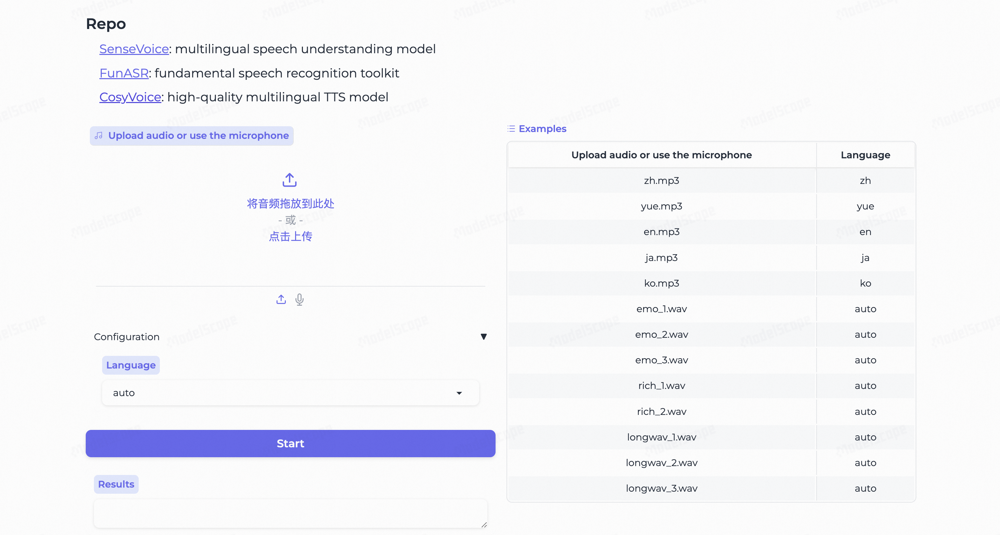

# 第 3 章：人机对话与多模态交互

对应教材 **3.4.1 人机对话实验、3.4.2 结合图像小模型、3.4.3 实机部署**。这三个小节共用一条主线：先让程序接收输入并给出文字回答，再接入图像、录音和语音输出。本实验不控制机械臂。

> **验证状态（2026-09-20）**：人机对话实验的手册修订、离线检查及学生本机离线复测已完成；本次未配置可用 DashScope Key，在线调用未执行。可先继续后续实验检查，尚未运行的部分保留待验证。原修订检查及 2026-09-19 学生复测的证据来源见[本次检查记录](../assets/ch3-dialogue/verification.md)。真实模型推理、录音、摄像头及完整交互链路仍待验证；下文 API 操作步骤与成功判据继续适用。

## 一、实验目标与提交内容

完成后应能解释：文本模型接收了什么，多模态模型接收了什么；BLIP描述遗漏信息后，下游回答为什么也可能出错；语音交互的错误发生在识别、回答还是合成阶段。

| 路线 | 输入→处理→输出 | 做到什么程度算完成 |
|---|---|---|
| A 文本API | 问题→千问文本模型→回答 | 得到与问题相关的回答，保存实际输出和请求编号 |
| B 图像API | 图片和问题→千问视觉模型→回答 | 能核对图片中的主要物体；换图后回答随之变化 |
| C 图像小模型 | 图片→BLIP描述→文本模型回答 | 同时保留caption与answer，并指出描述漏掉的细节 |
| D 语音识别 | 自己的录音→SenseVoice→文字 | 与实际说的话逐句核对，而不是只看程序没报错 |
| E 语音合成 | 回答文本和参考音频→CosyVoice2→wav | 文件可播放，内容与输入文字基本一致 |
| F 摄像头与集成 | 录音/图像→文字回答→语音 | 留下一条从原始输入到最终播放的完整记录 |

第一次做先完成A，再做B或C；D—F逐个接入。本地文本模型和MiniCPM部署保留在第八节，属于教材提供的另一条部署路线，不必为了完成API实验先下载它们。

**提交材料**：本次使用的命令、环境版本、真实结果、至少一个失败或不确定的例子，以及定位过程。可使用[运行记录模板](../assets/ch3-dialogue/run-record-template.md)。未做的分支明确写“未运行”。

### 与教材、原手册和课程代码的对应关系

以下页码为教材印刷页码，PDF 阅读器页码需加 18。先区分接口修正、版本调整与替代路线，再判断自己复现了哪一部分。

| 教材 / 代码依据 | 原手册或候选稿缺口 | 本页处理 |
|---|---|---|
| 3.4.1.1，67—69 页：`qwen-turbo`、`qwen-vl-plus` | 教材文本例的 `dashscope.='...'` 是语法错误；原手册已改用环境变量，但图像例缺少完整鉴权和结果解析步骤 | 保留原模型路线，用环境变量读取 Key，分别处理文本和图像响应；模型可用性需在自己的地域核对 |
| 3.4.1.2，69—71 页：第一代 `qwen/Qwen-7B-Chat`，Python 3.9、Transformers 4.32.0、`model.chat` | 原手册未覆盖本地路线；候选稿改成 Transformers 导入，未说明与教材 ModelScope 导入的差异 | 第八节保留教材 ModelScope 接口和历史依赖，标明未实测；不把 Qwen2.5 当作原模型 |
| 3.4.1.2，71—74 页：AutoDL 上 MiniCPM-V-2.6 | 原手册未覆盖；截图可见镜像显示名、4090/24 GB 和 notebook 路径，但没有唯一镜像 ID 或可下载的 notebook | 列出已知信息与停止点，不编造可租用的镜像或可运行脚本 |
| 3.4.2，75—76 页：BLIP caption → 文本模型 | 教材只提手工下载两个文件，代码却仍从模型 ID 加载；原手册未给 caption 到问题的实际传递命令 | 使用完整模型快照；保存 `caption.txt`，用 `--caption-file` 传给文本模型 |
| 3.4.3.1，77—78 页：SenseVoice-S；课程 `demo1.py` | 原手册默认 CUDA、仅改示例输入；教材“更新 torchaudio”不足以保证与 torch 兼容 | 保留 `iic/SenseVoiceSmall` 和 `fsmn-vad`，分环境运行，用自己的音频产出 `question.txt` |
| 3.4.3.2，78—79 页：CosyVoice2-0.5B、16 kHz 参考音频张量 | 原手册未给合成到输出的完整命令；新上游示例接口已变化 | 模型不变，但明确使用固定上游提交的路径接口，是接口适配，未经实机复测 |
| 3.4.3.3—3.4.3.4，79 页：摄像头 → 图像描述模型，集成语音模块 | 原手册只有流程列表；候选集成优先用了视觉 API | 第七节先给摄像头 → BLIP → 文本模型的教材链路；直接视觉 API 标为替代，文件交接标为非实时实现 |

本页脚本是为手册补写的教学入口，不是教材随书提供且已经验证的完整工程。

## 二、环境、代码与输入准备

### 2.1 不要混淆两个仓库

本页及可下载的教学脚本位于 `EAI_experiment_handbook`；教材原有工程位于 `EAI_project`。本页不改写后者。

```bash
git --version
conda --version
git clone --branch feature/whr https://github.com/SH9959/EAI_experiment_handbook.git
cd EAI_experiment_handbook
python -c "from pathlib import Path; Path('runs/dialogue').mkdir(parents=True, exist_ok=True)"
```

以上获取本次 PR 的修订分支；合并后可按课程要求使用主分支。若已有仓库，请先确认工作区并保留自己的文件，不要重复克隆进原目录。找不到 `git` 或 `conda` 时，先按[开始实验前](setup.md)完成工具准备。创建输入目录的命令使用 Python，可在 Bash 和 PowerShell 中执行；若此时没有 Python，可在激活下一节环境后执行。

```text
EAI_experiment_handbook/
├── docs/student/ch3-dialogue.md
└── docs/assets/ch3-dialogue/
    ├── dialogue_lab.py           # 配套入口，不自动安装依赖
    ├── test_dialogue_lab.py      # 离线测试，不调用模型
    ├── run-record-template.md
    └── verification.md
```

脚本也可以[单独下载](../assets/ch3-dialogue/dialogue_lab.py)。下面不带绝对路径的命令，均从手册仓库根目录运行。打开新终端后先回到该目录，再激活对应环境。

建议把手册、`EAI_project`、`CosyVoice` 放在同一实验父目录下，分别进入，不要克隆到彼此内部。记录自己的手册绝对路径，后文说“回到手册根目录”就是 `cd "这个路径"`。A/B 可在 Windows、Linux 或 macOS 上操作，C 的 CPU 路线不要求摄像头；D/E 优先用课程 Linux 机器，GPU 路线还需匹配驱动、CUDA 与 PyTorch。F 需要自己确认可用的摄像头、麦克风及播放设备，或使用已有且获授权的图片、录音先完成文件链路。

本地实验输出保存在 `runs/dialogue/`，不属于待提交的手册源码；提交实验报告时只挑选已检查且可公开的记录，不要把整个目录加入 Git。

### 2.2 A—C 的基础环境

```bash
conda create -n eai-dialogue python=3.10 -y
conda activate eai-dialogue
python -m pip install dashscope pillow
python -c "import sys; print(sys.executable); print(sys.version)"
python -c "from pathlib import Path; Path('runs/dialogue').mkdir(parents=True, exist_ok=True)"
python docs/assets/ch3-dialogue/dialogue_lab.py --help
python docs/assets/ch3-dialogue/test_dialogue_lab.py
```

Python 3.10是本修订的建议起点，不是原教材3.9环境已通过测试的替代证明。各库安装后记录实际版本；完整依赖组合仍需在课程机器复测后冻结。C路线另装PyTorch和Transformers，D/E使用独立环境。

A/B在云端计算，本机不要求GPU，但需要有效的百炼账号、已开通的模型和网络。调用可能计费。不要上传未获授权的照片、录音或实验室材料。

最后一条是离线单元测试：使用临时文件和模拟对象检查脚本，不需要 Key，也不证明模型或设备实验通过。BLIP、SenseVoice、CosyVoice 首次加载可能自动下载模型；先与教师确认网络、磁盘和下载额度，再执行对应命令。

### 2.3 配置密钥、地域和模型

按[百炼密钥说明](https://help.aliyun.com/zh/model-studio/get-api-key)取得自己的Key。Key、业务空间、地域、模型权限和端点必须匹配。不要把Key发到群里或提交到Git。

**Linux/macOS Bash：**

```bash
export DASHSCOPE_API_KEY="在本机填入自己的Key"
```

**Windows PowerShell：**

```powershell
$env:DASHSCOPE_API_KEY="在本机填入自己的Key"
```

检查是否设置，不打印密钥：

```bash
python -c "import os; print('已设置' if os.getenv('DASHSCOPE_API_KEY') else '未设置')"
```

需要指定端点时，在同一终端设置 `DASHSCOPE_HTTP_BASE_URL`，值从对应业务空间的官方调用示例复制；脚本也支持 `--base-url`。这里使用 **DashScope原生接口、以 `/api/v1` 结尾**，不要填OpenAI兼容模式的 `/compatible-mode/v1` 地址。不同地域不要共用一份照抄的端点配置。

下面沿用教材模型名 `qwen-turbo`、`qwen-vl-plus` 说明调用方式，**不保证它们在每个账号与地域都可用**。先在控制台确认；实际运行时把 `--model` 改为已开通且适配该接口的模型，并在记录中保存确切名称。本脚本演示非流式普通问答，不覆盖仅支持流式输出的模型。

## 三、先完成A：文本问答

### 3.1 只检查输入，不调用模型

```bash
python docs/assets/ch3-dialogue/dialogue_lab.py api --model qwen-turbo --question "如何做西红柿鸡蛋？"
```

不加 `--send`，只检查参数、路径和文件后缀并显示 `CHECK ONLY`；不验证图片内容或服务端可用性。这是离线检查，不会生成实验回答，也不能作为API成功记录。

### 3.2 发送一次真实请求

确认账号、模型和费用后执行：

```bash
python docs/assets/ch3-dialogue/dialogue_lab.py api --model qwen-turbo --question "如何做西红柿鸡蛋？" --output runs/dialogue/text_answer.txt --send
```

成功时生成 `text_answer.txt` 和同名 `.json` 记录。JSON 记录实际模型、耗时、SDK 版本、请求编号，并将内容正确性留给人工判断。`--output` 必须使用 `.txt`，且不能与输入文件或它的记录文件重合。API 失败不会生成新回答，但可能留下旧文件；磁盘写入中断也可能留下不完整文件。复测请换一个输出文件名，同时核对退出码、记录时间和本次命令，避免把旧结果当成本次成功。

`--max-tokens` 默认 256，允许 1—2048，用于限制输出长度。回答被截断时，可在预算允许时提高这个值重新运行；它不限制输入图片大小，也不是费用上限。PowerShell 用 `$LASTEXITCODE`、Bash 用 `$?` 查看刚执行命令的退出码；0 表示脚本完成，非 0 时先处理报错再进入下一步。

关键代码是：

```python
response = dashscope.Generation.call(
    api_key=os.getenv("DASHSCOPE_API_KEY"),
    model=model_name,
    messages=messages,
    result_format="message",
)
```

`messages`是对话输入，`model`是所调用模型，`result_format="message"`使回答以消息形式返回。本页脚本还检查HTTP状态和回答字段，并限制输出长度。

**核对结果**：是否回答了问题？有没有明显遗漏或事实错误？一个200状态码只证明请求返回成功。不要要求措辞与教材示例逐字相同。本脚本每次调用是一段新的对话；连续运行两次不会自动继承上次聊天记录。

## 四、图像进入系统的两种方式

### 4.1 B：直接把图片交给视觉模型

自己拍一张清晰的桌面照片，命名为 `scene.jpg`，放入手册根目录的 `runs/dialogue/`。先用图片查看器打开，确认方向、清晰度和隐私内容。

```bash
python docs/assets/ch3-dialogue/dialogue_lab.py api --model qwen-vl-plus --image runs/dialogue/scene.jpg --question "桌面上有哪些物品？看不清的部分请说明。" --output runs/dialogue/vision_answer.txt --send
```

脚本先确认文件存在，再构造本地文件URI。发送时会上传该图片，`file://`并不意味着云端模型直接读取你的硬盘。多模态响应的 `content` 通常是包含 `text` 字段的列表，与文本接口的字符串不同；配套入口分别处理。

**结果检查**：在输入图和回答中对应出主要物体。再拍一张移走一个物品后的照片，保持同一问题，观察回答是否随图片变化。两次案例是功能检查，不是模型准确率评测。

### 4.2 C：先用BLIP生成描述，再让文本模型回答

```bash
conda activate eai-dialogue
python -m pip install torch "transformers>=4.45,<5"
```

以上是功能依赖范围，不是完整环境锁文件。CPU先用于单张图片检查；使用CUDA时按[PyTorch安装说明](https://pytorch.org/get-started/locally/)选择匹配的发行包，不要把其他实验环境的torch直接升级。

```bash
python docs/assets/ch3-dialogue/dialogue_lab.py caption --image runs/dialogue/scene.jpg --device cpu --output runs/dialogue/caption.txt
python docs/assets/ch3-dialogue/dialogue_lab.py api --model qwen-turbo --caption-file runs/dialogue/caption.txt --question "这些物品中，哪些可以用来记笔记？" --output runs/dialogue/caption_answer.txt --send
```

第一次运行BLIP会获取模型和处理器文件，耗时可能主要来自下载。[官方模型卡](https://huggingface.co/Salesforce/blip-image-captioning-base)提供完整用法。离线机器应提前准备完整模型目录，并用 `caption --model 本地目录` 指向它，不能只拷贝权重文件和 `config.json`。

本入口使用教材的无条件描述分支，内部 `max_new_tokens=50`，输出 `caption.txt` 及同名 JSON；`--device cpu` 可换成 `cuda`，但应先确认 `torch.cuda.is_available()`。用文本编辑器打开 caption，至少能将主要场景与原图对应，再发送下一条 API 请求。加载或下载失败时停在 C 的第一步，不要把空文件接给文本模型。

这条路线中，文本模型**没有看到原图**，只看到 `caption.txt`。caption常为英文，可以保留英文观察输入信息是否完整。对照B路线时固定图片和问题，并分别记录视觉输入方式与模型名称，不能把模型不同带来的差异全部归因于“多模态优于小模型”。

## 五、D：把自己的录音转成文字

### 5.1 环境与课程源码

先用电脑录音软件录制约 5—10 秒的普通话问题，并实际播放一次。建议保存为单声道 WAV，将录音保存或复制到**手册根目录的 `runs/dialogue/question.wav`**。重命名扩展名不等于音频格式转换。

打开一个终端，先 `cd` 到存放手册的**父目录**，再获取课程工程；如果已按“开始实验前”下载过，可使用那个副本。下列固定提交便于与本页核对，已有副本存在未提交修改时不要直接切换：

```bash
git clone https://github.com/SH9959/EAI_project.git
cd EAI_project
git checkout e6bb5d5de828b5d87834ea169b53c09b376d8b09
cd chapter_3/3_3_human_perception/3.3.3/SenseVoice
conda create -n eai-sensevoice python=3.10 -y
conda activate eai-sensevoice
python -m pip install -r requirements.txt
python -c "import torch, torchaudio, funasr; print(torch.__version__, torchaudio.__version__, torch.cuda.is_available())"
```

课程原脚本 `demo1.py` 测试多种语言的示例音频，默认 `device="cuda:0"`。没有 CUDA 时不能原样使用这个设置。教材写 `funasr>=1.1.2`，指定课程提交的 requirements 更具体：`funasr>=1.1.3`、`torch<=2.3`、`numpy<=1.26.4`；按此文件安装，完成后用 `python -m pip check` 检查依赖冲突。torch 与 torchaudio 需要成套兼容，不是只把 torchaudio 升级到最新就能解决问题。音频解码报错时再按官方要求检查 FFmpeg，不要从头重装所有环境。

上面的提交固定的是源码，不锁定运行时下载的模型/VAD版本。复测时还应记录模型缓存版本。本例会执行课程仓库的 `model.py`；`trust_remote_code=True` 只用于已核对的源码，不要对陌生模型随意启用。

### 5.2 单独识别，再接文本模型

回到手册仓库根目录。下面 `--repo` 请填上一步SenseVoice目录的**绝对路径**，而不是 `EAI_project` 根目录：

```bash
python docs/assets/ch3-dialogue/dialogue_lab.py asr --repo "/你的目录/EAI_project/chapter_3/3_3_human_perception/3.3.3/SenseVoice" --audio runs/dialogue/question.wav --device cpu --output runs/dialogue/question.txt
```

有可用GPU时可改成 `--device cuda:0`。CPU能否在可接受时间完成，应按课程机器实测，不承诺实时速度。

先打开 `question.txt`，与录音逐句核对。若使用了新终端，先按 2.3 在这个终端重新设置 Key 和地域；切换 Conda 环境不会从另一个终端取得环境变量。确认内容正确后再执行：

```bash
conda activate eai-dialogue
python docs/assets/ch3-dialogue/dialogue_lab.py api --model qwen-turbo --question-file runs/dialogue/question.txt --output runs/dialogue/answer.txt --send
```

这里通过文件连接不同环境。不要把ASR控制台的模型加载日志直接作为大模型输入，也不要把一整个Conda环境叠装成另一个环境。

ASR 会加载 `iic/SenseVoiceSmall` 与 `fsmn-vad`，输出 `question.txt` 及同名 JSON。`language="auto"` 自动判断语言，`use_itn=True` 做文本规整，`merge_vad=True` 合并语音段；先保留这些参数，用清晰的短录音检查漏字和误字。下面是课程仓库已有的界面示意，用于认识模块，并非本次运行截图：



## 六、E：把回答合成为语音

### 6.1 固定本例接口版本

保留教材的 **CosyVoice2-0.5B** 模型。本修订按上游提交 `074ca6dc9e80a2f424f1f74b48bdd7d3fea531cc` 的 `example.py` 调整调用：使用 `AutoModel(model_dir=...)`，零样本合成接收参考音频路径。教材旧例接收16 kHz张量，**两版接口不要混用**。

建议先在Linux课程机器完成此分支。Windows上的TTS依赖尚未在本修订中验证；基础API与图像路线不依赖这一步。

先确认课程机器驱动、磁盘和下载预算：该版本 requirements 包含 Linux 下的 PyTorch、torchaudio、CUDA/TensorRT 等较大依赖，安装依赖本身也可能大量下载，不只是模型快照占空间。没有匹配环境时先停在本节，不将安装成功视为推理成功。

```bash
# 从存放两个课程仓库的父目录开始
git clone --recursive https://github.com/QwenAudio/CosyVoice.git
cd CosyVoice
git checkout 074ca6dc9e80a2f424f1f74b48bdd7d3fea531cc
git submodule update --init --recursive
conda create -n eai-cosyvoice python=3.10 -y
conda activate eai-cosyvoice
conda install -y -c conda-forge pynini==2.1.5
python -m pip install -r requirements.txt
python -c "from modelscope import snapshot_download; snapshot_download('iic/CosyVoice2-0.5B', local_dir='pretrained_models/CosyVoice2-0.5B')"
```

使用ModelScope下载完整快照，避免普通Git克隆只得到大文件指针。确认 `pretrained_models/CosyVoice2-0.5B/cosyvoice2.yaml`、模型文件及 `third_party/Matcha-TTS/matcha/` 均存在。模型快照的版本仍需在真实联调后记录，不能把固定源码提交等同于锁定所有依赖。

注意：该上游版本直接执行 `python example.py` 默认进入CosyVoice3示例。本实验只准备了CosyVoice2，使用下面的配套入口，不要因此再下载与本实验无关的模型。

### 6.2 生成一个可播放的回答

第一次可使用该提交自带的 `asset/zero_shot_prompt.wav`。在手册的 `runs/dialogue/prompt.txt` 中保存与之对应的参考文本：

```text
希望你以后能够做的比我还好呦。
```

确认已有第五节生成的 `answer.txt`。回到手册仓库根目录，仍保持 `eai-cosyvoice` 环境：

```bash
python docs/assets/ch3-dialogue/dialogue_lab.py tts --repo "/你的目录/CosyVoice" --text-file runs/dialogue/answer.txt --prompt-text-file runs/dialogue/prompt.txt --prompt-wav "/你的目录/CosyVoice/asset/zero_shot_prompt.wav" --output runs/dialogue/reply.wav
```

参考音频与参考文本是此零样本接口的输入，不能因为“不想模仿声音”就直接省略。更换为自己的音频时，只使用本人或获授权的声音，并同步修改其转写；指定源码要求参考音频不超过 30 秒。脚本把所有输出片段拼接成一个 WAV，使用模型给出的输出采样率，不会自动播放或上传它。

**验收**：实际播放 `reply.wav`；检查是否漏句、读错内容、明显爆音或语速异常。先确认ASR得到的问题和LLM的回答正确，再分析TTS，不能把上游错误归为合成错误。

## 七、F：摄像头与完整交互

### 7.1 摄像头采一帧

```bash
conda activate eai-dialogue
python -m pip install opencv-python
python docs/assets/ch3-dialogue/dialogue_lab.py capture --camera 0 --output runs/dialogue/camera_scene.jpg
```

这一步只在本机保存图片，不发送到云端。打开图片确认清晰后，用第四节的 `--image runs/dialogue/camera_scene.jpg` 进行图像问答。设备打开失败时检查系统隐私权限、摄像头是否被会议软件占用，再试实际存在的设备编号。

执行 `capture` 会立即打开指定摄像头，读取若干帧后保存最后一个有效帧并释放设备。只在自己已确认设备使用许可时执行。`--camera 0` 是默认设备编号，不保证每台机器都有设备 0；脚本不会录音或自动播放。

### 7.2 先完成文件级集成

本版给出的是可逐段排错的**文件级集成**，不是实时语音助手：

```text
question.wav → SenseVoice → question.txt
camera_scene.jpg → BLIP → caption.txt
question.txt + caption.txt → 文本API → answer.txt
                                         ↓
zero_shot_prompt.wav + prompt.txt → CosyVoice2 → reply.wav → 人工播放
```

按教材 3.4.3 的图像描述路线操作：先在 `eai-sensevoice` 环境执行第五节命令得到 `question.txt`，人工核对；再从手册根目录执行：

```bash
conda activate eai-dialogue
python docs/assets/ch3-dialogue/dialogue_lab.py caption --image runs/dialogue/camera_scene.jpg --device cpu --output runs/dialogue/caption.txt
python docs/assets/ch3-dialogue/dialogue_lab.py api --model qwen-turbo --question-file runs/dialogue/question.txt --caption-file runs/dialogue/caption.txt --output runs/dialogue/answer.txt --send
```

打开 `caption.txt` 和 `answer.txt` 分别核对，随后激活 `eai-cosyvoice`，执行第六节同一条 TTS 命令，将 `answer.txt` 与参考音频、参考文本一起变成 `reply.wav`。如果其中某一步退出非 0，停止链路并查该步骤，不继续消费可能属于上一次运行的同名文件。

**替代路线：摄像头图片直接交给视觉 API**。这对应教材 3.4.1.1 的多模态调用，跳过了 3.4.3 所说的图像描述模块，不算 BLIP 集成复现。用下面命令替换上面的 caption 与文本 API 两步，然后保持相同的 TTS 输入文件：

```bash
python docs/assets/ch3-dialogue/dialogue_lab.py api --model qwen-vl-plus --question-file runs/dialogue/question.txt --image runs/dialogue/camera_scene.jpg --output runs/dialogue/answer.txt --send
```

每一步都成功后再开发实时采集、自动播放和打断。实时系统还需要录音结束判定、设备释放和超时处理，这些不在本版脚本中。提交记录应注明采用文件级还是实时链路。

**端到端验收**：保留同一轮的原始录音、图片、转写、caption（使用时）、回答及合成音频。对照原始问题和画面，确认最终音频回答的是这一轮的问题，逐项记录识别、视觉描述、回答内容和听感；只有各阶段都有真实输出，才能把这条文件链路记为完成。

## 八、教材本地部署路线：保留与待补内容

### 8.1 原教材Qwen-7B-Chat

目标是在本机连续对话并用 `history` 传递上一轮上下文，输入为文字问题，输出为各轮回答。教材使用第一代 `qwen/Qwen-7B-Chat`、`transformers==4.32.0` 和 `model.chat(...)`，不是 Qwen2.5 的 `apply_chat_template` 用法。教材标注模型文件约 14.4 GB；这不是显存下限，还需激活、缓存和运行时空间。优先使用教师确认可承载该模型的 Linux GPU 机器，教材未给可保证运行的最小显存配置。

**未运行的历史环境复测路线**：以下保留教材的模型和接口，并补上目录与输出。它不是已验证的环境锁；取得机器配置、完整快照及教师确认的兼容依赖后再执行。教材原依赖清单还包括 `peft deepspeed`，下面普通对话的最小推理安装省去这两项训练相关依赖；这是依赖整理，不能当作原历史环境的完整复现。若要严格重建教材全量环境，需向教师取得锁文件，不应直接混装最新版 PEFT 与旧 Transformers。若安装解析冲突或导入失败，记录冲突版本停在这里，不要在 A—C 环境中降级 Transformers。依据为[第一代 Qwen 官方模型卡](https://huggingface.co/Qwen/Qwen-7B-Chat)及教材 69—71 页。

工作目录仍为手册仓库根目录。先创建独立环境，再按课程驱动配置从 [PyTorch 官方安装页](https://pytorch.org/get-started/locally/)选择兼容安装命令；这里不编造适用于所有 GPU 的 CUDA 版本。

```bash
conda create -n eai-qwen-original python=3.9 -y
conda activate eai-qwen-original
python -m pip install modelscope "transformers==4.32.0" accelerate tiktoken einops scipy "transformers_stream_generator==0.0.4"
python -m pip check
python -c "import torch; print(torch.__version__, torch.cuda.is_available())"
```

在本机确认下载额度和磁盘后运行下列命令。它把快照放在 `runs/dialogue/qwen-cache/`，把下载返回的**真实目录**保存到 `qwen-model-path.txt`，避免下载到一个目录却又从模型 ID 重新加载：

```bash
python -c "from pathlib import Path; from modelscope import snapshot_download; p=snapshot_download('qwen/Qwen-7B-Chat', cache_dir='runs/dialogue/qwen-cache'); Path('runs/dialogue/qwen-model-path.txt').write_text(str(Path(p).resolve()), encoding='utf-8')"
```

已有离线快照时，跳过下载，在 `runs/dialogue/qwen-model-path.txt` 写入完整快照绝对路径。保存下面代码为 `runs/dialogue/local_qwen.py`，再从手册根目录执行它。这里沿用教材的 ModelScope 导入；`trust_remote_code=True` 会执行模型快照中的 Python，只加载核对过来源和版本的模型。

```python
from pathlib import Path
from modelscope import AutoModelForCausalLM, AutoTokenizer

root = Path("runs/dialogue")
model_dir = (root / "qwen-model-path.txt").read_text(encoding="utf-8-sig").strip()
tokenizer = AutoTokenizer.from_pretrained(model_dir, trust_remote_code=True)
model = AutoModelForCausalLM.from_pretrained(
    model_dir, device_map="auto", trust_remote_code=True
).eval()
history = None
records = []
for question in ["你好", "给我讲一个年轻人奋斗创业最终取得成功的故事。", "给这个故事起一个标题"]:
    answer, history = model.chat(tokenizer, question, history=history)
    if not isinstance(answer, str) or not answer.strip():
        raise RuntimeError("模型未返回文字，停止本轮实验。")
    records.append(f"问题：{question}\n回答：{answer}")
(root / "local_qwen_answers.txt").write_text("\n\n".join(records), encoding="utf-8")
print("已保存 runs/dialogue/local_qwen_answers.txt，请人工核对三轮上下文。")
```

```bash
python runs/dialogue/local_qwen.py
```

**成功判据与排错**：三轮均有回答，第三轮标题确实针对第二轮故事；保存输出、模型快照 revision、驱动和依赖版本。显存不足时先记录 GPU 和占用，向教师确认资源，不能把模型文件大小当显存需求；没有 `model.chat` 时检查是否拿错代际/快照以及是否允许加载已审核的模型代码；依赖冲突时保留报错和 `pip check` 结果，请教师提供可工作的历史环境。换小模型属于替代练习，需要单独记录模型与接口，不能记作第一代 7B 原实验通过。

### 8.2 原教材MiniCPM-V-2.6云端部署

目标是在租用的 GPU 实例中用本地多模态模型回答图片问题。教材依赖 AutoDL 社区镜像及镜像内的 `run.ipynb`。印刷页 72—73 的截图可读到镜像显示名 `OpenBMB/MiniCPM-V/MiniCPM-V-2.6`、示例 RTX4090 24 GB、工作目录 `/root/MiniCPM-V` 及模型路径 `pretrained_weights/MiniCPM-V-2_6`；这些是教材示例，不能当最低硬件要求或当前仍可租用的保证。

**受阻点：尚无唯一镜像 ID/版本、完整 notebook、可复现依赖清单和模型 revision。** 截图中能看到 `trust_remote_code=True`、`attn_implementation='sdpa'`、`torch_dtype=torch.bfloat16` 与 `.eval().cuda()`，但不能据此补造完整推理代码。课程仓库也未提供该 notebook，因此目前无法给出可信的自动运行命令。

**补齐后的最小复测**：教师发放上述资料并确认预算 → 选择指定镜像及已验证 GPU 配置 → 在 JupyterLab 进入指定工作目录 → 打开交付的 `run.ipynb`，逐格运行 → 输入自己的清晰图片和问题 → 保存已执行 notebook、图片、实际回答及环境版本。输出位置应在拿到 notebook 后核实并补写，不能先假定存在某个结果文件。成功要求模型在指定环境加载完成且回答能对应图片中的主要内容；加载失败先核对镜像/模型 revision、依赖和显存，停止反复租实例。资料未齐时可先完成 B 路线，但 B 通过不代表 MiniCPM 部署通过。

## 九、排错与结果分析

| 现象 | 先检查什么 | 下一步 |
|---|---|---|
| `CHECK ONLY`，但没有回答文件 | 是否少了 `--send` | 确认模型与费用后再发送，不把检查提示当模型输出 |
| 提示Key未设置 | 是否在当前终端设置，是否换了终端 | 只检查存在性，勿打印Key截图 |
| 401 / 403 | Key、业务空间、地域、模型权限 | 按百炼控制台调用示例核对，不无限重试 |
| 429 / 额度错误 | 限流、余额或额度 | 先停止批量调用，按平台提示处理 |
| 导入失败 | 当前Python解释器和Conda环境 | 在对应环境安装，不混装语音和图像依赖 |
| 模型下载慢或失败 | 模型地址连通性、缓存目录、磁盘 | 保留完整快照及版本；不要反复删除缓存重下 |
| BLIP漏掉小物体 | 输入图清晰度及caption本身 | 对照原图；文本模型不能恢复从未传给它的细节 |
| SenseVoice输出不对 | 先听原录音 | 检查静音、噪声、格式和语言，不先改LLM提示词 |
| TTS加载错误 | CosyVoice源码提交、模型代际、子模块 | 核对本页指定接口，勿混用旧张量与新路径写法 |
| 有WAV但听起来不对 | 回答文本、参考文本、输出采样率 | 实际播放后逐段定位，不只检查文件大小 |
| 摄像头打不开 | 隐私权限、设备编号、占用 | 关闭占用程序，再单独采一帧 |

**思考题**：同一幅图通过B、C两条路线得到不同回答，能否确定是谁出错？应保存哪些中间结果？将问题换成图片中看不见的细节时，模型应怎样回答？加入语音后，如何区分ASR错误与推理错误？

阅读：[百炼视觉输入与本地文件说明](https://help.aliyun.com/zh/model-studio/vision)、[BLIP模型卡](https://huggingface.co/Salesforce/blip-image-captioning-base)、[课程SenseVoice示例](https://github.com/SH9959/EAI_project/blob/e6bb5d5de828b5d87834ea169b53c09b376d8b09/chapter_3/3_3_human_perception/3.3.3/SenseVoice/demo1.py)、[本页采用的CosyVoice示例](https://github.com/QwenAudio/CosyVoice/blob/074ca6dc9e80a2f424f1f74b48bdd7d3fea531cc/example.py)。
