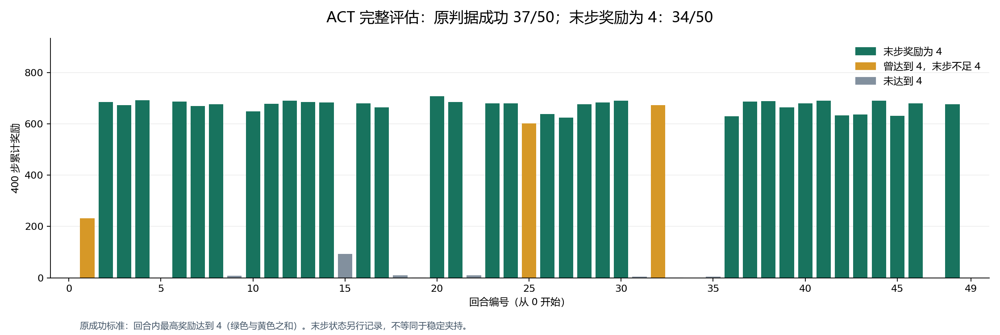

# 第 5 章：ACT 模仿学习

对应教材 **5.7.1 模仿学习实验**：先完成方块传递的 ACT 仿真，再在 cobot-magic 平台上采集示教、训练和推理。

## 一、实验目标

理解 ACT 如何用相机图像和关节状态预测一段连续动作，完成“示教数据 → 数据检查 → 训练 → 执行评估”的流程。记录训练损失、实际任务成功率和失败过程，区分模仿误差降低与任务完成。

仿真以 `sim_transfer_cube_scripted`、50 条示教为基线；实机沿用教材的双臂方块传递任务，采集 50 条示教。缺少实机时完成仿真，并在报告中列出实机所需设备和未完成步骤。

已有一次完整仿真记录可供对照：**50 条示教、2000 轮训练、50 回合评估，按原程序判据成功 37/50（74%），平均回报 490.26**。其中 34 回合末步奖励仍为 4，另 3 回合曾达到 4、后来掉落；74% 不是稳定夹持率。该记录使用 Windows CUDA 训练和 Ubuntu CPU 评估适配，不能作为下文原 Linux CUDA 全流程或实机已通过的证明。只查看或核对这份结果时，直接进入第四节，无需重新训练。

没有 GPU、只想检查已有模型能否加载并预测动作时，走[单输入 CPU 对照](#42-cpu)。它复用保存的真实图像和关节状态，不采集、不训练、不执行 50 回合，也不计算新的任务成功率。

## 二、实验环境配置

### 2.1 ACT 仿真环境

以下命令在 **Linux Bash** 中执行。准备 Conda、可用的 NVIDIA GPU 和驱动；训练与评估源码直接调用 `.cuda()`，本页没有 CPU 训练路线。仿真图像也需要可用的 OpenGL 渲染环境。50 条未压缩的单相机示教仅 RGB 像素约占 **18.4 GB**，另留依赖、checkpoint 和视频空间。

仅检查示教采集时，可使用已验证的 [CPU 采集入口](../assets/ch5-imitation/verification.md#cpu)，完成两条示教、HDF5 检查和视频回放；训练仍需配置下方 GPU 环境。

使用 [ACT 固定提交](https://github.com/tonyzhaozh/act/tree/742c753c0d4a5d87076c8f69e5628c79a8cc5488)，保留教材 Python 3.8.10、MuJoCo 2.3.7 和 dm_control 1.0.14。PyTorch 与 torchvision 使用[官方历史版本表](https://pytorch.org/get-started/previous-versions/#v201)中的配对，示例选择 CUDA 11.8；驱动不支持该运行时时，先由环境维护者确认可用组合。

```bash
mkdir -p "$HOME/eai-lab"
cd "$HOME/eai-lab"
git clone https://github.com/tonyzhaozh/act.git
cd act
git checkout 742c753c0d4a5d87076c8f69e5628c79a8cc5488

conda create -n act-sim python=3.8.10 -y
conda activate act-sim
python -m pip install torch==2.0.1 torchvision==0.15.2 \
  --index-url https://download.pytorch.org/whl/cu118
python -m pip install "numpy<2" pyquaternion pyyaml rospkg pexpect \
  mujoco==2.3.7 dm_control==1.0.14 opencv-python matplotlib \
  einops packaging h5py ipython tqdm
cd detr
python -m pip install -e .
cd ..
python -m pip check
python -c "import torch, torchvision, mujoco, dm_control; print(torch.__version__, torchvision.__version__, mujoco.__version__); print('CUDA:', torch.cuda.is_available())"
python -m pip freeze > environment-sim.txt
```

检查导入无错误且 `CUDA: True` 后再训练。上述依赖包含未固定版本的包，保存 `environment-sim.txt` 作为本机解析结果；仓库的 `conda_env.yaml` 使用另一组 Python/MuJoCo 版本，不要混用两套安装流程。首次构造模型可能下载 ResNet-18 预训练权重，需预留网络或使用实验室已有缓存。

后续仿真命令均从 `$HOME/eai-lab/act` 执行。新开终端时先运行：

```bash
conda activate act-sim
cd "$HOME/eai-lab/act"
```

### 2.2 cobot-magic 实机环境

设备按教材配置：两个主臂、两个从臂、三个 Orbbec Dabai 相机，工控机使用 Ubuntu 20.04 与 ROS1 Noetic。优先使用实验台已联调的系统和 Python 环境，确认 CAN 对应关系、相机序列号、急停和运动范围后再启动机械臂。

实机代码采用[教材指定仓库的固定提交](https://github.com/sheji105/cobot_magic/tree/70c11788f1a750c3e27453a2472fdd6bea59c675)。实际目录是 **`aloha-devel`**。

```bash
cd "$HOME/eai-lab"
git clone https://github.com/sheji105/cobot_magic.git
cd cobot_magic
git checkout 70c11788f1a750c3e27453a2472fdd6bea59c675
```

每个实机终端先设置根目录；运行 Python 的终端另激活实验台的 `cobot-act` 环境：

```bash
export COBOT_ROOT="$HOME/eai-lab/cobot_magic"
source /opt/ros/noetic/setup.bash
```

若实验台尚无环境，以下是依赖准备入口，需继续通过后面的导入检查。独立环境避免两个仓库的 `detr` 相互覆盖。

```bash
conda create -n cobot-act python=3.8 -y
conda activate cobot-act
cd "$COBOT_ROOT/aloha-devel"
python -m pip install torch==2.0.1 torchvision==0.15.2 \
  --index-url https://download.pytorch.org/whl/cu118
python -m pip install -r requirements.txt -r ../collect_data/requirements.txt
cd act/detr
python -m pip install -e .
cd ../..
python -m pip check
python -c "import torch, rospy; from cv_bridge import CvBridge; print('CUDA:', torch.cuda.is_available())"
python act/train.py --help
python act/inference.py --help
python -m pip freeze > environment-real.txt
```

`requirements.txt` 中 PyTorch 版本只是注释，不能只安装这一文件。训练还会导入随仓库附带的 `robomimic`，以及通过 requirements 安装的依赖 `diffusers`，所以工作目录必须是 `aloha-devel`。若 `cv_bridge`、`robomimic` 或 `diffusers` 导入失败，停在环境准备阶段，保存错误并使用实验台与该提交匹配的环境锁定文件；本仓库未提供完整可复现的 ROS/Python 依赖锁。不要把 `--help` 失败当作训练问题。

在未激活 Conda 的 ROS 终端编译：

```bash
cd "$COBOT_ROOT/remote_control"
bash tools/build.sh
cd "$COBOT_ROOT/camera_ws"
catkin_make
```

两个工作空间均编译成功后，由设备负责人核对 `remote_control/tools/can.sh` 的设备映射，以及 `camera_ws/src/ros_astra_camera/launch/multi_camera.launch` 的三台相机序列号。仓库脚本含作者机器配置，不能据文件存在就认定适用于本实验台。

## 三、实验过程

### 3.1 仿真数据采集与检查

在 ACT 根目录编辑 `constants.py`，把 `DATA_DIR` 改为：

```python
DATA_DIR = str(pathlib.Path(__file__).resolve().parent / 'data')
```

保持 `sim_transfer_cube_scripted` 的配置为 `num_episodes=50`、`episode_len=400`、`camera_names=['top']`。训练从这里读取数据位置，没有 `--dataset_dir` 参数；实际数据目录必须是 `data/sim_transfer_cube_scripted`。

先在独立目录采集 2 条检查渲染和保存：

```bash
python record_sim_episodes.py \
  --task_name sim_transfer_cube_scripted \
  --dataset_dir "$PWD/data/sim_transfer_cube_check" \
  --num_episodes 2 --onscreen_render
python visualize_episodes.py \
  --dataset_dir "$PWD/data/sim_transfer_cube_check" --episode_idx 0
```

观察双臂是否完成方块传递。脚本先执行末端空间策略，再回放关节指令；终端最后的 `Success: 成功条数 / 总条数` 是示教回放结果。失败回合也会保存为 HDF5，文件存在不等于成功示教。可视化应在数据目录生成 `episode_0_video.mp4` 和 `episode_0_qpos.png`；检查画面、夹爪动作和关节曲线。录制显示使用 `angle` 视角，基线保存和训练使用 `top`，两者不同是正常的。

检查通过后，在新的正式数据目录录制 50 条，并保存完整日志：

```bash
set -o pipefail
python record_sim_episodes.py \
  --task_name sim_transfer_cube_scripted \
  --dataset_dir "$PWD/data/sim_transfer_cube_scripted" \
  --num_episodes 50 2>&1 | tee record-sim.log
python visualize_episodes.py \
  --dataset_dir "$PWD/data/sim_transfer_cube_scripted" --episode_idx 1
```

正式目录应含 `episode_0.hdf5` 至 `episode_49.hdf5`。同目录重新录制会从 0 开始覆盖，重试时另建目录并同步任务配置。训练前检查数量和关键字段：

```bash
python - <<'PY'
from pathlib import Path
import h5py
from constants import SIM_TASK_CONFIGS
c = SIM_TASK_CONFIGS['sim_transfer_cube_scripted']
for i in range(c['num_episodes']):
    p = Path(c['dataset_dir']) / f'episode_{i}.hdf5'
    with h5py.File(p, 'r') as f:
        assert bool(f.attrs['sim']), p
        for key in ['observations/qpos', 'observations/qvel', 'action']:
            assert f[key].shape == (400, 14), (p, key, f[key].shape)
        assert f['observations/images/top'].shape == (400, 480, 640, 3), p
print('50 episodes: shapes OK')
PY
```

这个检查只验证结构，仍需抽查开头、中间、末尾的回合视频。保留失败示教的编号和表现；若重新采集或筛选数据，在报告中记录，不能仍称为同一份基线数据。

### 3.2 ACT 训练与仿真评估

先用 2 个 epoch 检查数据加载、GPU、损失和 checkpoint 写出。输出目录已存在时，换一个新名称再运行：

```bash
CKPT_DIR="$PWD/ckpt/smoke"
if [ -e "$CKPT_DIR" ]; then
  echo "输出目录已存在，请更换 CKPT_DIR。"
else
  python imitate_episodes.py \
    --task_name sim_transfer_cube_scripted --ckpt_dir "$CKPT_DIR" \
    --policy_class ACT --kl_weight 10 --chunk_size 100 --hidden_dim 512 \
    --batch_size 8 --dim_feedforward 3200 --num_epochs 2 --seed 0 --lr 1e-5
fi
```

这只检查训练流程，不能代表策略已经学会任务。确认日志出现有限的 train/validation loss 后，使用新的目录进行教材的 2000 epoch 基线训练。以下 Bash 数组让训练和评估复用相同参数；若更换终端，需重新定义数组。

```bash
CKPT_DIR="$PWD/ckpt/transfer_seed0"
ACT_ARGS=(
  --task_name sim_transfer_cube_scripted --ckpt_dir "$CKPT_DIR"
  --policy_class ACT --kl_weight 10 --chunk_size 100 --hidden_dim 512
  --batch_size 8 --dim_feedforward 3200 --num_epochs 2000 --seed 0 --lr 1e-5
)
set -o pipefail
if [ -e "$CKPT_DIR" ]; then
  echo "输出目录已存在，请更换 CKPT_DIR。"
else
  python imitate_episodes.py "${ACT_ARGS[@]}" 2>&1 | tee train-sim.log &&
  python imitate_episodes.py "${ACT_ARGS[@]}" --eval 2>&1 | tee eval-sim.log
fi
```

训练正常结束后，`ckpt/transfer_seed0` 应含 `policy_best.ckpt`、`policy_last.ckpt`、周期 checkpoint、`dataset_stats.pkl` 和 `train_val_{kl,l1,loss}_seed_0.png`。评估加载 **`policy_best.ckpt`** 及同目录的统计文件，并执行 50 次 rollout；输出 `result_policy_best.txt`、`video0.mp4` 至 `video49.mp4`。源码以回合最高奖励达到 4 计算成功率，平均回报另行统计。

奖励 4 表示当时左夹爪接触方块、方块未接触桌面。回合中短暂达到这一状态也会计为成功，因此还要检查视频末尾是否掉落，并在失败分析中记录。

每轮先验证再更新参数；若最佳轮次为 epoch 0，`policy_best.ckpt` 是首次更新前的模型，`policy_last.ckpt` 则保存最终更新结果。记录数据集和完整命令，`--seed` 是训练种子，不控制采集或评估的随机性。

阅读汇总并核对至少一个成功与一个失败回合；没有失败时如实记录。损失下降而任务失败时，从抓取、交接、夹持和放置阶段定位问题。教材与作者给出的结果只是参考，报告填写本次实际成功数和总数。

扩展实验可增加 `--temporal_agg`，比较时间集成对抖动和成功率的影响。先另存基线结果和视频，该参数不会自动建立新输出目录；不要覆盖后把两个设置混为一组。

### 3.3 实机启动与数据采集

启动前由设备负责人按本机映射启用 CAN 接口，完成相机序列号配置，并清空机械臂运动区域。不要直接照抄含作者机器配置与密码的 `can.sh`。先用以下只读命令核对预期 CAN 接口均存在且带有 `UP` 标志；未启用时交由设备负责人处理，`roslaunch` 不会代为启用 CAN。

```bash
ip -details link show
```

确认后按终端分别运行以下命令，所有终端均需完成第二节的根目录与 ROS 初始化。

| 终端 | 工作目录与命令 | 检查内容 |
|---|---|---|
| ROS 主节点 | `roscore` | 只运行一个 ROS master |
| 相机 | `cd "$COBOT_ROOT/camera_ws"`；`source devel/setup.bash`；`roslaunch astra_camera multi_camera.launch` | 包名为 `astra_camera` |
| 四个机械臂终端 | 分别进入 `$COBOT_ROOT/remote_control/master1`、`master2`、`follow1`、`follow2`；执行 `source devel/setup.bash` 和 `roslaunch arm_control arx5v.launch` | 启动可能回初始位，由设备负责人逐臂确认 |
| 检查终端 | `rostopic list`，再运行 `rqt` | 图像、关节数据持续更新 |

`tools/start.sh` 和 `tools/start01.sh` 都按当前工作目录寻找机械臂目录，且自行启动 roscore/相机。本页采用逐项启动，不与这些脚本重复运行。

先核对以下对应关系，左右相机不能互换：

| 实际话题 | HDF5 相机键 | 视角 |
|---|---|---|
| `/camera_f/color/image_raw` | `cam_high` | 中间 |
| `/camera_l/color/image_raw` | `cam_left_wrist` | 左腕 |
| `/camera_r/color/image_raw` | `cam_right_wrist` | 右腕 |

还需持续收到 `/master/joint_left`、`/master/joint_right`、`/puppet/joint_left`、`/puppet/joint_right`。话题名称与本机不同，必须用采集脚本的对应 `--img_*_topic`、`--master_arm_*_topic`、`--puppet_arm_*_topic` 参数同步调整，推理也使用同一映射。

本页使用 RGB 基线：在学生的 `collect_data/collect_data.py` 中，仅将 `--use_depth_image` 的 `default=True` 改为 `default=False`。此版本参数用了 `type=bool`，传 `--use_depth_image False` 实际仍会变成真，不能这样关闭深度图。训练和推理的该选项默认已为 False。三路 RGB、每条 500 帧、50 条未压缩数据仅像素约占 **69.1 GB**，采集前确认磁盘空间。

在采集终端激活 `cobot-act`，先录一条：

```bash
conda activate cobot-act
cd "$COBOT_ROOT/collect_data"
python collect_data.py \
  --dataset_dir "$COBOT_ROOT/data" --task_name transfer_cube \
  --max_timesteps 500 --episode_idx 0
python visualize_episodes.py \
  --dataset_dir "$COBOT_ROOT/data" --task_name transfer_cube --episode_idx 0
```

手动操作主臂完成传递后，数据写入 `data/transfer_cube/episode_0.hdf5`。此版本可视化入口是 **`visualize_episodes.py`**，输出视频、关节曲线和底盘曲线位于 `data/`，不是任务子目录；其 `DT=0.02` 与采集默认 30 Hz 不同，若保持采集 30 Hz，应把可视化脚本中的 `DT` 改为 `1 / 30`，避免视频播放速度误导观察。

确认图像方向、关节维度和动作都正常后，逐次把 `--episode_idx` 改为 1 至 49，采满 50 条；每条重新放置方块并记录成败，不要用循环代替人工准备。HDF5 应含三路上述图像键、`observations/qpos` 和 `action`，本配置形状分别为 `(500,480,640,3)` 与 `(500,14)`。同编号会覆盖已有文件。

### 3.4 实机训练与推理

在学生的 `aloha-devel/act/train.py` 中，把 `TASK_CONFIGS` 内的 **`'num_episodes': 60` 改为 `50`**，与教材采集数量一致。保留相机顺序 `['cam_high', 'cam_left_wrist', 'cam_right_wrist']`。源码用字符串拼接数据根目录和任务名，所以 `--dataset` 最后必须保留 `/`。

```bash
conda activate cobot-act
cd "$COBOT_ROOT/aloha-devel"
python act/train.py \
  --dataset "$COBOT_ROOT/data/" --task_name transfer_cube \
  --ckpt_dir "$COBOT_ROOT/ckpt/transfer_real_seed0" \
  --policy_class ACT --chunk_size 30 --hidden_dim 512 --dim_feedforward 3200 \
  --kl_weight 10 --batch_size 48 --num_epochs 3000 --seed 0
```

先把 `--num_epochs` 改为 2、输出目录改为独立的 `ckpt/real_smoke` 检查流程，再执行完整训练。正式输出包含 `policy_best.ckpt`、`policy_last.ckpt`、`dataset_stats.pkl` 与损失曲线；保存修改后的脚本、命令和环境清单，不能用仿真的 checkpoint 或统计文件替换。

!!! danger "实机推理前检查"
    推理程序会发送关节指令，并且在 `input("please input:")` 之前已经执行一次初始位运动。必须在启动命令前确认急停可用、人员离开运动范围、初始姿态可达，且设备负责人在场。先停止两个主臂的遥操作发布，只保留从臂、相机和 ROS master，避免多个节点同时控制从臂。

在相同环境、相同相机映射下，从 `aloha-devel` 执行：

```bash
python act/inference.py \
  --ckpt_dir "$COBOT_ROOT/ckpt/transfer_real_seed0" \
  --ckpt_name policy_best.ckpt --ckpt_stats_name dataset_stats.pkl \
  --policy_class ACT --chunk_size 30 --hidden_dim 512 --dim_feedforward 3200 \
  --kl_weight 10 --max_publish_step 500
```

训练与推理保持 ACT 结构、相机顺序、RGB/深度和底盘选项一致。本配置每轮最多发布 500 步，但源码外层还会继续下一轮，**这不是整次实验的自动停止开关**；单次观察完成后由操作人员停止进程。默认从臂指令话题是 `/master/joint_left` 和 `/master/joint_right`，名称看似主臂，仍须与本机从臂订阅关系核对。

先在训练范围内的固定位置测试，再小范围改变方块位置；逐次记录成功、掉落、交接失败、停顿或异常运动。实机程序没有仿真式的自动任务成功判定，需事先约定成功标准并人工计数。

## 四、实验结果

### 4.1 核对已有基线

从**手册仓库根目录**执行以下命令，只读取仓库内的[50 回合结果](../assets/ch5-imitation/act-evaluation-20261002.json)，无需 PyTorch、GPU 或示教数据：

```bash
python docs/assets/ch5-imitation/verify_act_evidence.py
```

具体核验命令与输出范围见[证据核验说明](../assets/ch5-imitation/verification.md#evidence-check-20261002)。摘要一致只说明记录内部一致，不能代替原始轨迹、视频或一次新的策略执行。原始 50 份轨迹与视频由课程维护者提供，领取后再进行文件哈希和逐步奖励核验；仓库中的 JSON 不包含这些大文件。

如需比较本机适配与正文 Linux CUDA 路线，查看[实际补丁、环境快照和剩余复现条件](../assets/ch5-imitation/adaptation-notes.md)。



上图包含所有失败回合。第 1 回合曾达到奖励 4 后掉落，第 2 回合末步仍满足奖励条件，第 0 回合未达到成功条件；编号从 0 开始。早期 2 条示教、3 轮短训练的 0/1 失败保留在[历史验证记录](../assets/ch5-imitation/verification.md)，不与这份完整基线混合统计。

### 4.2 单输入 CPU 对照

先按[独立 CPU 环境说明](../assets/ch5-imitation/cpu-environment.md)准备环境，再领取[资源清单](../assets/ch5-imitation/cpu-reference-resources.json)中的原件。需要固定源码 ZIP、完整训练的 best、配套统计文件、ResNet-18 缓存、参考 NPZ 及两份来源报告；这条路线不需要 50 条 HDF5 或全部录像。缺文件时停在资源准备，不能用早期短训练权重替换。

下面假定原件放在同一个 `ACT_RESOURCES` 目录；把清单中 `training_report` 对应的原 `result.json` 原样复制为 `training-result.json`，只改副本文件名、保持内容与哈希不变，以免与本次推理的结果文件混淆。ResNet-18 放在该目录下的 `torch-cache/hub/checkpoints/resnet18-f37072fd.pth`；其余文件沿用清单中的名称。

**Windows PowerShell：**从手册仓库根目录执行，替换下面三个路径。`ACT_PY` 必须指向刚创建并检查通过的独立 venv 解释器；无需激活环境。输出目录须尚不存在，且位于资源目录外。

```powershell
$ACT_PY = 'C:/绝对路径/act-cpu-reference-01/Scripts/python.exe'
$ACT_RESOURCES = 'D:/绝对路径/act-resources'
$ACT_OUTPUT = 'D:/绝对路径/act-results/cpu-reference-01'
if (Test-Path -LiteralPath $ACT_OUTPUT) { throw '请更换为新的输出目录' }
& $ACT_PY -I docs/assets/ch5-imitation/run_act_cpu_reference.py `
  --source-archive "$ACT_RESOURCES/act-742c753c0d4a5d87076c8f69e5628c79a8cc5488.zip" `
  --checkpoint "$ACT_RESOURCES/policy_best.ckpt" --stats "$ACT_RESOURCES/dataset_stats.pkl" `
  --torch-home "$ACT_RESOURCES/torch-cache" `
  --reference "$ACT_RESOURCES/reference.npz" --reference-report "$ACT_RESOURCES/reference.json" `
  --training-report "$ACT_RESOURCES/training-result.json" `
  --output $ACT_OUTPUT --threads 4 --timeout-seconds 180
```

**Ubuntu Bash：**只有完成独立环境准备与检查后才运行。保留环境说明设置的 `ACT_PY`；新终端需重新设为该 venv 的 `bin/python` 绝对路径。资源布局相同，从手册仓库根目录执行：

```bash
ACT_RESOURCES="/绝对路径/act-resources"
ACT_OUTPUT="/绝对路径/act-results/cpu-reference-01"
"$ACT_PY" -I docs/assets/ch5-imitation/run_act_cpu_reference.py \
  --source-archive "$ACT_RESOURCES/act-742c753c0d4a5d87076c8f69e5628c79a8cc5488.zip" \
  --checkpoint "$ACT_RESOURCES/policy_best.ckpt" --stats "$ACT_RESOURCES/dataset_stats.pkl" \
  --torch-home "$ACT_RESOURCES/torch-cache" \
  --reference "$ACT_RESOURCES/reference.npz" --reference-report "$ACT_RESOURCES/reference.json" \
  --training-report "$ACT_RESOURCES/training-result.json" \
  --output "$ACT_OUTPUT" --threads 4 --timeout-seconds 180
```

入口先核对哈希，再在新目录准备仅修改 ACT 设备放置的源码，执行一次 CPU 前向推理。它禁止联网下载，最多运行 180 秒，保留日志、预测数组和 JSON 结果。只想检查输入时加 `--preflight-only`，之后真正推理仍需换新输出目录。

`SINGLE_INPUT_VERIFIED` 表示输出为有限的 `(1,100,14)` 动作块，且归一化及还原后的动作均与已有 GPU 参考满足 `rtol=atol=1e-4`；它不证明方块传递成功。还需单独查看环境是否独立：继承另一环境时，即使数值通过，也不能记为独立安装通过。预检、超时、依赖缺失或数值不符均保留原记录，按[本次验证与阻碍](../assets/ch5-imitation/verification.md#cpu-reference-portable)定位。

### 4.3 提交本次实验结果

提交以下材料，并将“未执行”与真实失败分开记录：

| 项目 | 报告内容 |
|---|---|
| 环境与数据 | 源码提交、依赖清单、数据目录、50 条编号、相机配置、筛选或重录记录 |
| 数据检查 | HDF5 字段/形状、一条示教视频和关节曲线、示教回放成败 |
| 仿真基线 | 训练参数、损失曲线、checkpoint 名、50 次评估成功数/成功率、平均回报 |
| 失败分析 | 至少一例失败的具体阶段与对应视频；全成功时如实说明 |
| 对比实验 | 若运行时间集成等扩展，保存独立结果，说明只改变了哪些条件 |
| 实机部分 | 设备配置、数据检查、训练结果、人工评估次数/成功数；无设备时写明卡在的步骤 |

训练损失、短流程检查与官方参考成功率不能代替本次执行证据。本页修订的源码依据和实际检查范围见[验证记录](../assets/ch5-imitation/verification.md)。

## 五、排错建议与注意事项

| 现象 | 排查顺序 |
|---|---|
| 仿真训练找不到 HDF5 | 检查 `constants.py` 的 `DATA_DIR`、任务子目录和连续编号，不能给训练脚本增加不存在的 `--dataset_dir` |
| 找到文件却提示缺少相机键 | 对照任务的 `camera_names` 与 HDF5 键；仿真 `top` 和实机三相机配置不能混用 |
| MuJoCo/GLFW/EGL 报错 | 先确认本机渲染驱动与显示会话；取消 `--onscreen_render` 仍需离屏渲染，不会自动解决 OpenGL 问题 |
| CUDA 不可用或显存不足 | 检查驱动与 PyTorch 配对；显存不足可减小 batch size 并记录，完整训练和评估继续使用匹配的模型结构 |
| 数据录制一直等待 | 检查所有必需相机/关节话题及时间戳；RGB 基线确认深度开关确实关闭 |
| 实机训练寻找第 50 至 59 条或错误目录 | 检查 `num_episodes=50`、任务名和 `--dataset` 尾部 `/` |
| checkpoint 加载维度不符 | 核对两个仓库是否混用、chunk size、hidden dim、相机数、深度/底盘选项及配套统计文件 |
| loss 下降但传递失败 | 回看示教质量、初始位置分布和失败阶段，再决定增加训练或改善数据；不以某个 loss 阈值判定成功 |

所有重新录制、重新训练和对比评估使用独立输出目录。实机训练数据、相机安装位置或归一化统计改变后，重新核对推理配置；保留上一组可追溯的结果。
